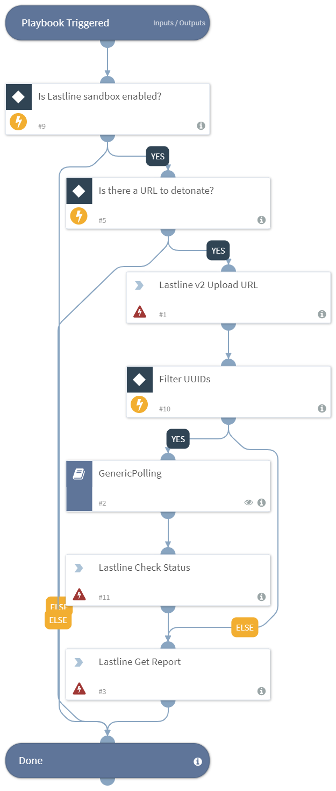

Detonates a URL using the Lastline Sandbox integration.

## Dependencies
This playbook uses the following sub-playbooks, integrations, and scripts.

### Sub-playbooks
* GenericPolling

### Integrations
This playbook does not use any integrations.

### Scripts
This playbook does not use any scripts.

### Commands
* lastline-upload-url
* lastline-check-status
* lastline-get-report

## Playbook Inputs
---

| **Name** | **Description** | **Default Value** | **Source** | **Required** |
| --- | --- | --- | --- | --- |
| URL | The URL to detonate. | Data | URL | Optional |
| Interval | The polling frequency. How often the polling command should run (in minutes). | 1 | - | Optional |
| Timeout | The amount of time to wait before a timeout occurs (in minutes). | 15 | - | Optional |

## Playbook Outputs
---

| **Path** | **Description** | **Type** |
| --- | --- | --- |
| File.Size | The file size (only in case of report type=json). | number |
| DBotScore.Indicator | The indicator that was tested (only in case of report type=json). | string |
| DBotScore.Vendor | The vendor used to calculate the score (only in case of report type=json). | string |
| DBotScore.Score | The actual score (only in case of report type=json). | number |
| IP.Address | The IP addresses's relevant to the sample. | string |
| DBotScore.Type | The type of the indicator (only in case of report type=json). | string |
| File.Name | The filename (only in case of report type=json). | string |
| File.Type | The file type. For example, "PE" (only in case of report type=json). | string |
| File.MD5 | The MD5 hash of the file (only in case of report type=json). | string |
| File.SHA1 | The SHA1 hash of the file (only in case of report type=json). | string |
| File.SHA256 | The SHA256 hash of the file (only in case of report type=json). | string |
| File.EntryID | The Entry ID of the sample. | string |
| File.Malicious.Vendor | The vendor that determined that a file is malicious. | string |
| File.Malicious.Description | The reason that the vendor determined that the file is malicious. | string |
| URL.Data | The list of malicious URLs identified by Lastline analysis. | string |
| URL.Malicious.Vendor | The vendor that determined that the URL is malicious. | string |
| URL.Malicious.Description | The reason that the vendor determined that the URL is malicious. | string |
| URL.Malicious.Score | The score that the malicious URL received from the vendor. | number |
| File.Malicious.Score | The score that the malicious file received from the vendor. | number |
| Lastline.Submission.Status | The status of the submission. | string |
| Lastline.Submission.DNSqueries | The list of DNS queries done by the analysis subject. | string |
| Lastline.Submission.NetworkConnections | The list of network connections done by the analysis subject. | string |
| Lastline.Submission.DownloadedFiles | The list of files that were downloaded using the Microsoft Windows file-download API functions. Each element is a tuple of file-origin URL and a File element. | string |
| Lastline.Submission.UUID | The ID of the submission. | string |
| Lastline.Submission.YaraSignatures.name | The Yara signatures name. | string |
| Lastline.Submission.YaraSignatures.score | The score according to the yara signatures. Must be from 0 to 100. | number |
| Lastline.Submission.Process.arguments | The argument of the process. | string |
| Lastline.Submission.YaraSignatures.internal | Whether the signature is only for internal use. | boolean |
| Lastline.Submission.Process.process_id | The process ID. | string |
| Lastline.Submission.Process.executable.abs_path | The absolute path of the executable of the process. | string |
| Lastline.Submission.Process.executable.filename | The filename of the executable. | string |
| Lastline.Submission.Process.executable.yara_signature_hits | The Yara signature of the executable of the process. | string |
| URL | The URL object. | unknown |
| URL.Malicious | The URL Malicious object. | unknown |
| DBotScore | The DBot score object. | unknown |
| Lastline.Submission | The Lastline submission object. | unknown |

## Playbook Image
---

