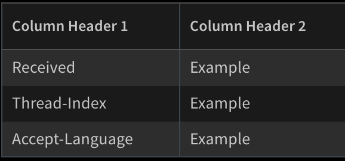
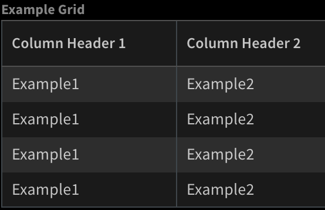

Update Grid Table from items or key value pairs.
## Script Data
---

| **Name** | **Description** |
| --- | --- |
| Script Type | python3 |
| Tags |  |
| Demisto Version | 5.0.0 |

## Inputs
---

| **Argument Name** | **Description** |
| --- | --- |
| context_path | Context path to list of items with similar properties or key value pairs. |
| grid_id | Grid ID to modify. |
| overwrite | True if to overwrite Grid Data, False otherwise. |
| columns | Grid columns \- comma sperated \(col1,col2,..,coln\) |
| keys | Keys to retrieve from items or &quot;\*&quot; for max keys \(limited when item list to columns amount\) \- Key will not be columns correlated. |
| sort_by | Column name to sort the rows by. |

## Command Example
Assume the following:
1. Entry Context:
```json
{
    "EWS": {
        "Items": {
            "HeadersMap": {
                    "X-MS-Exchange-Organization-AuthSource": "Example", 
                    "Received": "Example", 
                    "Thread-Index": "Example", 
                    "Accept-Language": "Example", 
            }, 
            "headers": [
                {
                    "name": "Example1", 
                    "value": "Example2"
                }, 
                {
                    "name": "Example1", 
                    "value": "Example2"
                }, 
                {
                    "name": "Example1", 
                    "value": "Example2"
                }, 
                {
                    "name": "Example1", 
                    "value": "Example2"
                }
            ]
        }
    }
}
```

2. Grid: \


Considering the following cases:
1. Key value to Grid:
```shell script
!SetGridField columns="columnheade1,columnheade2,columnheade3" context_path=EWS.Items.HeadersMap grid_id=mygrid keys="Received,Thread-Index"
```

Grid after update: \

 
2. List of item properties to Grid:
```shell script
!SetGridField columns="columnheade1,columnheade2,columnheade3" context_path=EWS.Items.headers grid_id=mygrid keys="Received,Thread-Index"
```

Grid after update: \
 


