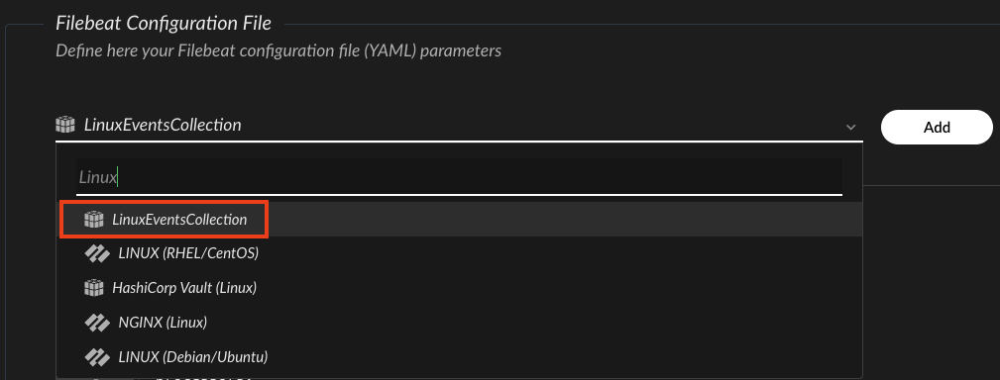

# Linux Events Collection

## Collector Configuration

Use one of the following options to collect Linux events into Cortex XSIAM:
  - [Broker VM Syslog Applet](#broker-vm)
  - [Filebeat XDRC (XDR Collector)](#xdrc-xdr-collector)

After the Cortex XSIAM collector starts ingesting logs from the Linux servers, you can query the logs under the linux_linux_raw dataset.

### Broker VM

#### Prerequisites

You need to set and configure a Broker VM. For more information, see [Broker VM](https://docs-cortex.paloaltonetworks.com/r/Cortex-XSIAM/Cortex-XSIAM-Documentation/Broker-VM).

#### Configuration Steps

1. Navigate to **Settings** &rarr; **Configuration** &rarr; **Data Broker** &rarr; **Broker VMs**. 
2. Go to the **APPS** column under the **Brokers** tab and add the **Syslog** app for the relevant broker instance. If the Syslog app already exists, hover over it and click **Configure**.
3. Click **Add New**.
4. When configuring the Syslog Collector, set the following parameters:
   | Parameter     | Value    
   | :---          | :---                    
   | `Vendor`      | **linux**. 
   | `Product`     | **linux**. 
  
### XDRC (XDR Collector)

#### Configuration Steps

Follow the steps bellow for configuring an [XDR Collector](https://docs-cortex.paloaltonetworks.com/r/Cortex-XSIAM/Cortex-XSIAM-Documentation/Manage-XDR-Collectors):
1. Create an XDR Collector installation package as described [here](https://docs-cortex.paloaltonetworks.com/r/Cortex-XSIAM/Cortex-XSIAM-Documentation/Create-an-XDR-Collector-installation-package).
2. Install the XDR Collector installation package for Linux on the requested Linux servers as described [here](https://docs-cortex.paloaltonetworks.com/r/Cortex-XSIAM/Cortex-XSIAM-Documentation/Install-the-XDR-Collector-installation-package-for-Linux). 
3. Configure an [XDR Collector Filebeat profile](https://docs-cortex.paloaltonetworks.com/r/Cortex-XSIAM/Cortex-XSIAM-Documentation/XDR-Collector-profiles) for the requested linux servers as described [here](https://docs-cortex.paloaltonetworks.com/r/Cortex-XSIAM/Cortex-XSIAM-Documentation/Add-an-XDR-Collector-profile-for-Linux).
      - When configuring the Filebeat YAML configuration file, use the *LinuxEventCollection* template as a reference:
 
    - Customize the *[paths](https://www.elastic.co/guide/en/beats/filebeat/current/filebeat-input-filestream.html#filestream-input-paths)* parameter in accordance to the requested log files for collection: 
         ```yaml
            filebeat.inputs:
            - type: filestream
              enabled: true
              paths: # customize paths as necessary 
                - /var/log/syslog
                - /var/log/auth.log
                - /var/log/messages
                - /var/log/secure
              processors:
                - add_fields:
                    fields:
                      vendor: linux
                      product: linux
         ```
4. Apply the configured Filebeat profile to the requested target Linux servers by attaching it to a policy as described [here](https://docs-cortex.paloaltonetworks.com/r/Cortex-XSIAM/Cortex-XSIAM-Documentation/Apply-profiles-to-collection-machine-policies).


#### Supported Timestamp formats 
##### Broker VM Syslog
- [RFC 3164](https://datatracker.ietf.org/doc/html/rfc3164#section-4.1.2) compatible timestamps, in UTC, for example: *`Oct  8 19:44:40`*. 
  **Note**: 
  You can run the following command on the relevant Linux servers to configure their timezone to UTC:    
  ```bash 
  sudo timedatectl set-timezone UTC
  ```
- [RFC 3339](https://www.rfc-editor.org/rfc/rfc3339) and ISO 8601 compatible like timestamps. 
  **Examples**: 
   - *`2024-10-28T14:30:55Z`*
   - *`2024-10-28T14:30:55-0300`*
   - *`2024-10-28T14:30:55-03:00`*
   - *`2024-10-28 14:30:55.123+0300`*  
   - *`2024-10-28 14:30:55.123+03:00`*
  
##### Filebeat XDR Collector
- [RFC 3339](https://www.rfc-editor.org/rfc/rfc3339) and ISO 8601 compatible like timestamps. 
**Examples**: 
   - *`2024-10-28T14:30:55Z`*
   - *`2024-10-28T14:30:55-0300`*
   - *`2024-10-28T14:30:55-03:00`*
   - *`2024-10-28 14:30:55.123+0300`*  
   - *`2024-10-28 14:30:55.123+03:00`*

**Note**: 
Event logs collected via Filebeat with timestamp formats other than those listed above are assigned the agent collection time.