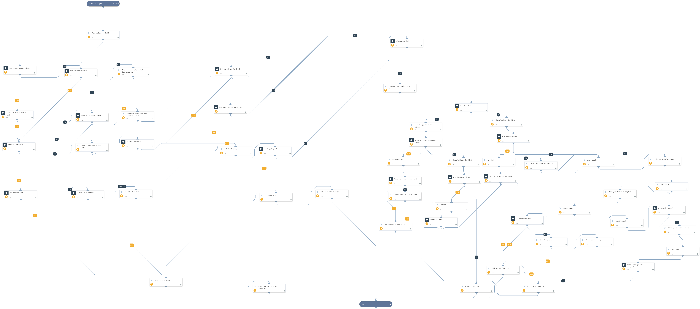

LogPoint SIEM Playbook guides users on use cases like blocking IP and domain and disabling users using products like CheckPoint Firewall, Active Directory, and VirusTotal. The actions depicted in the playbook helps analysts create their playbooks based on actual requirements and products deployed. (Available from Cortex XSOAR 6.0.0).

## Dependencies
This playbook uses the following sub-playbooks, integrations, and scripts.

### Sub-playbooks
This playbook does not use any sub-playbooks.

### Integrations
* Active Directory Query v2
* VirusTotal
* LogPoint SIEM Integration
* CheckPointFirewall_v2

### Scripts
* CalculateEntropy
* Sleep

### Commands
* checkpoint-application-site-category-get
* checkpoint-show-objects
* checkpoint-access-rule-add
* ad-get-user
* ad-disable-account
* ip
* domain
* checkpoint-packages-list
* checkpoint-host-add
* checkpoint-gateways-list
* lp-add-incident-comment
* checkpoint-application-site-category-add
* checkpoint-login-and-get-session-id
* lp-get-incident-data
* checkpoint-application-site-add
* checkpoint-install-policy
* checkpoint-show-task
* checkpoint-logout
* lp-assign-incidents
* checkpoint-publish

## Playbook Inputs
---
There are no inputs for this playbook.

## Playbook Outputs
---
There are no outputs for this playbook.

## Playbook Image
---
