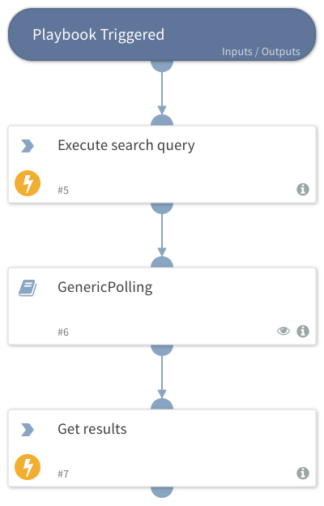

This playbook used generic polling to gets query result using the command: lr-execute-search-query

## Dependencies
This playbook uses the following sub-playbooks, integrations, and scripts.

### Sub-playbooks
GenericPolling

### Integrations
LogRhythmRest

### Scripts
This playbook does not use any scripts.

### Commands
* lr-execute-search-query
* lr-get-query-result

## Playbook Inputs
---

| **Name** | **Description** | **Default Value** | **Required** |
| --- | --- | --- | --- |
| number_of_days | Number of days to search. | 7 | Required |
| source_type | Log source type. |  | Optional |
| host_name | Impacted host name. |  | Optional |
| username | Username. |  | Optional |
| subject | Email subject. |  | Optional |
| sender | Email sender. |  | Optional |
| recipient | Email recipient. |  | Optional |
| hash | Hash. |  | Optional |
| URL | URL. |  | Optional |
| process_name | Process name. |  | Optional |
| object | Log object. |  | Optional |
| ip_address | IP address. |  | Optional |
| max_massage | Maximum number of log message to query. | 10 | Optional |
| query_timeout | Execute search query to LogRhythm log database. | 60 | Optional |

## Playbook Outputs
---

| **Path** | **Description** | **Type** |
| --- | --- | --- |
| Logrhythm.Search.Results.TaskStatus | Task status. | string |
| Logrhythm.Search.Results.TaskID | Task ID. | string |
| Logrhythm.Search.Results.Items.originEntityId | Entity ID. | number |
| Logrhythm.Search.Results.Items.impactedIp | Impacted IP. | string |
| Logrhythm.Search.Results.Items.classificationTypeName | Classification name. | string |
| Logrhythm.Search.Results.Items.logSourceName | Log source name. | string |
| Logrhythm.Search.Results.Items.entityName | Entity .ame. | string |
| Logrhythm.Search.Results.Items.normalDate | Date. | date |
| Logrhythm.Search.Results.Items.vendorMessageId | Vendor log message. | string |
| Logrhythm.Search.Results.Items.priority | Log priority. | number |
| Logrhythm.Search.Results.Items.sequenceNumber | Sequence number. | string |
| Logrhythm.Search.Results.Items.originHostId | Origin host ID. | number |
| Logrhythm.Search.Results.Items.mpeRuleId | LogRhythm rule ID. | number |
| Logrhythm.Search.Results.Items.originIp | Origin IP. | string |
| Logrhythm.Search.Results.Items.mpeRuleName | LogRhythm rule name. | string |
| Logrhythm.Search.Results.Items.logSourceHostId | Log source host ID. | number |
| Logrhythm.Search.Results.Items.originHost | Origin host. | string |
| Logrhythm.Search.Results.Items.logDate | Log date. | date |
| Logrhythm.Search.Results.Items.classificationName | Log classification name. | string |

## Playbook Image
---

