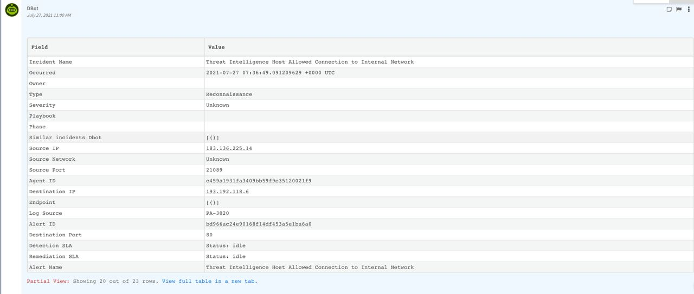

Logsign SIEM provides comprehensive visibility and control of your data lake by allowing security analysts to collect and store unlimited data, investigate and detect threats, and respond automatically.

This integration was integrated and tested with version 4.6.x of Logsign SIEM

## Configure Logsign SIEM in Cortex


| **Parameter** | **Description** | **Required** |
| --- | --- | --- |
| Server URL (e.g. https://192.168.0.1) | Logsign SIEM API URL | True |
| API Key | The API Key to use for connection | True |
| Trust any certificate (not secure) |  | False |
| Use system proxy settings |  | False |
| Last Run Time (ISO8601 format with UTC) | Last run time format like '%Y-%m-%dT%H:%M:%SZ' | True |
| First Fetch Time (default 1 hour) | First Fetch Time \(e.g 1 hour\) | False |
| isFetch |  | False |
| Max Fetch | Maximum number of incidents per fetch \(Recommended less than 200\) | False |

## Commands
You can execute these commands from the CLI, as part of an automation, or in a playbook.
After you successfully execute a command, a DBot message appears in the War Room with the command details.
### logsign-fetch-incidents
***
Gets Incidents from Logsign SIEM


#### Base Command

`logsign-fetch-incidents`
#### Input

| **Argument Name** | **Description** | **Required** |
| --- | --- | --- |
| last_run | Last Run Fomat: '%Y-%m-%dT%H:%M:%SZ'. Possible values are: . | Required | 
| query | Lucene query support | Optional | 


#### Context Output

| **Output Path** | **Type** | **Description** |
| --- | --- | --- |
| Logsign.Incidents.Severity.Name | String | Incident Severity | 
| Logsign.Incidents.Time.Generated | date | Time Generation of incident |
| Logsign.Incidents.EventMap.Context | String | Context of Event |
| Logsign.Incidents.Event.Category | String | Category of triggered event |
| Logsign.Incidents.EventSource.IP | unknown | The eventsource addresses that are associated with the incident |
| Logsign.Incidents.Destination.IP | unknown | The destination addresses that are associated with the incident |
| Logsign.Incidents.Source.IP | unknown | The source addresses that are associated with the incident |
| Logsign.Incidents.Destination.Port | unknown | Destination Port |
| Logsign.Incidents.Source.Port | unknown | Source Port |
| Logsign.Incidents.Alert.Category | String | Category of Incident |
| Logsign.Incidents.Alert.Info | String | Incident Description |
| Logsign.Incidents.Alert.AlertUID | Number | ID of Incident |
| Logsign.Incidents.Alert.TriggerEventID | Number | Trigger Event ID |
| Logsign.Incidents.EventSource.HostName | String | The eventsource hostname that are associated with the incident |


#### Command Example

`!logsign-fetch-incidents last_run=2021-07-27T10:27:00Z`

#### Context Example

```json
{
  "success": true,
  "incidents": [
    {
      "Packets": {
        "Total": 2,
        "Sent": 1,
        "Received": 1
      },
      "Bytes": {
        "Total": 124,
        "Sent": 60,
        "Received": 64
      },
      "Severity": {
        "ID": 4,
        "Name": "warning"
      },
      "Time": {
        "Generated": "2021-07-27 10:35:33",
        "Start": "2021-07-27 10:26:40",
        "Received": "2021-07-27 10:35:33"
      },
      "EventMap": {
        "Context": "Network",
        "Type": "Session",
        "SubType": "Allow",
        "ID": 60101,
        "Info": "Network Connection Allow"
      },
      "Event": {
        "VendorID": 2,
        "SystemID": 30292,
        "Action": "allow",
        "SubCategory": "end",
        "Reason": "tcp-rst-from-server",
        "Category": "TRAFFIC",
        "TrackID": "2c60f28a"
      },
      "EventSource": {
        "IP": "10.x.x.1",
        "Serial": "001801044448",
        "Vendor": "PaloAlto",
        "Type": "Security System",
        "Category": "Firewall",
        "PrefixID": 3029,
        "HostName": "PA-3020",
        "Description": "PaloAlto",
        "Collector": "alert.flow"
      },
      "Session": {
        "RepeatCount": "1",
        "ID": "137290"
      },
      "Application": {
        "Name": "incomplete"
      },
      "Destination": {
        "IP": "193.x.x.6",
        "City": "Istanbul",
        "Country": "Turkey",
        "Interface": "ethernet1/3.100",
        "Port": 80,
        "Zone": "LogsignServers",
        "NatIP": "10.x.x.10",
        "NatPort": 80,
        "Location": "Unknown",
        "Position": "in"
      },
      "Source": {
        "IP": "183.x.x.14",
        "Country": "China",
        "Interface": "ethernet1/12",
        "Port": 21089,
        "Zone": "untrust",
        "NatIP": "183.x.x.14",
        "NatPort": 21089,
        "Location": "Unknown",
        "Position": "out"
      },
      "URL": {
        "Category": "any"
      },
      "Protocol": {
        "Name": "TCP"
      },
      "Rule": {
        "Name": "IsmailLogsign"
      },
      "Details": {
        "EndReason": "tcp-rst-from-server"
      },
      "DataType": "alert",
      "rawmsg": "Jul 27 10:26:44 PA-3020 1,2021/07/27 10:26:44,001801044448,TRAFFIC,end,2304,2021/07/27 10:26:44,183.136.225.14,193.192.118.6,183.136.225.14,10.10.100.2,IsmailLogsign,,,incomplete,vsys1,untrust,LogsignServers,ethernet1/12,ethernet1/3.100,LogsignSyslogProfile,2021/07/27 10:26:44,137290,1,21089,80,21089,80,0x40401b,tcp,allow,124,60,64,2,2021/07/27 10:26:40,0,any,0,2622656518,0x0,China,Turkey,0,1,1,tcp-rst-from-server,0,0,0,0,,PA-3020,from-policy,,,0,,0,,N/A,0,0,0,0,1cf61932-8145-4fd8-8d01-7a410f782236,0",
      "Internal": {
        "IP": "193.x.118.6"
      },
      "External": {
        "IP": "183.x.225.14"
      },
      "Intelligence": {
        "IP": "183.x.225.14",
        "Info": "Attack Info",
        "ListID": 1029,
        "Type": "Attack"
      },
      "Context": {
        "SourceIP": [
          "Suspicious"
        ]
      },
      "Behavior": {
        "SourceIP": [
          "Threat Intelligence IPs"
        ]
      },
      "_insert_time": 1627371333,
      "Alert": {
        "Category": "Threat Intelligence",
        "Info": "Threat Intelligence Host Allowed Connection to Internal Network",
        "AlertUID": "bd966ac24e90168f14df453a5e1ba6a0",
        "TriggerEventID": "c459a1931fa3409bb59f9c35120021f9",
        "Reason": "EventMap.Type:Session\nEventMap.SubType:Allow\nDestination.Position:in\nBehavior.SourceIP:Threat Intelligence IPs"
      },
      "Action": {
        "Object": "183.x.225.14",
        "CoManaged": "collect",
        "FeedList": "ip"
      },
      "_es_type": "flow@alert@generic_log"
    }
  ]
}
```

#### Human Readable Output



### logsign-get-columns-query
***
Gets column values based on your lucene query


#### Base Command

`logsign-get-columns-query`
#### Input

| **Argument Name** | **Description** | **Required** |
| --- | --- | --- |
| query | Query Description. | Required | 
| grouped_column | Group Column . | Required | 
| criteria | Criteria Value. Possible values are: unique,  value. | Required | 
| time_frame | Time Frame (e.g 1 hour). | Required | 


#### Context Output

| **Path** | **Type** | **Description** |
| --- | --- | --- |
| LogsignSiem.Columns | Unknown | Column list returned as the result of the query | 


#### Command Example
```!logsign-get-columns-query criteria="value" grouped_column="Source.IP" query="*" time_frame="1 day"```

#### Context Example
```json
{
    "Logsign SIEM": {
        "Columns": {
            "columns": [
                "192.x.1.35",
                "192.x.1.17",
                "192.x.1.18",
                "192.x.1.5",
                "192.x.1.93"
            ]
        }
    }
}
```

#### Human Readable Output

>### Results
>|columns|
>|---|
>|192.168.1.35,<br/>192.168.1.17,<br/>192.168.1.18,<br/>192.168.1.5,<br/>192.168.1.93|


### logsign-get-count-query
***
Gets count of column values.


#### Base Command

`logsign-get-count-query`
#### Input

| **Argument Name** | **Description** | **Required** |
| --- | --- | --- |
| query | Query. | Required | 
| grouped_column | Grouped Column. | Required | 
| criteria | Criteria Value. Possible values are: unique,  value. | Required | 
| time_frame | Time Frame. | Required | 


#### Context Output

| **Path** | **Type** | **Description** |
| --- | --- | --- |
| LogsignSiem.Count | Number | Count number returned as the result of the query | 


#### Command Example
```!logsign-get-count-query criteria="value" grouped_column="Source.IP" query="*" time_frame="1 day"```

#### Context Example
```json
{
    "Logsign SIEM": {
        "Count": {
            "count": 785554
        }
    }
}
```

#### Human Readable Output

>### Results
>|count|
>|---|
>| 785554 |