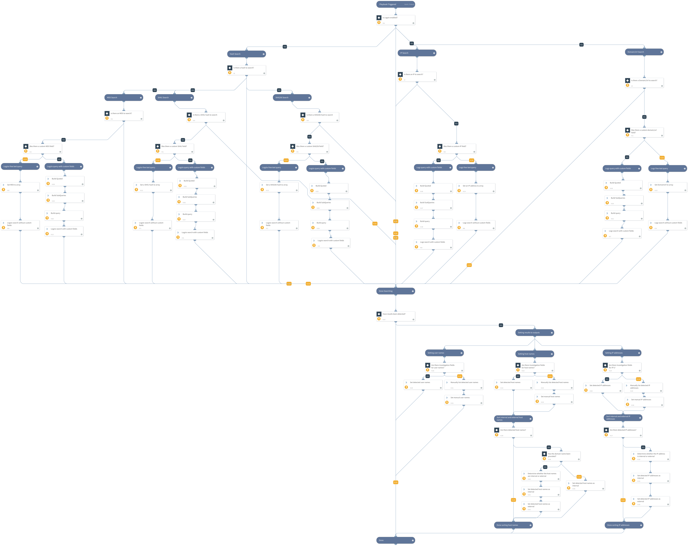

This playbook queries Logz.io in order to hunt indicators such as
File Hashes
IP Addresses
Domains \ URLS
And outputs the related users, IP addresses, host names for the indicators searched.

## Dependencies
This playbook uses the following sub-playbooks, integrations, and scripts.

### Sub-playbooks
This playbook does not use any sub-playbooks.

### Integrations
* Logzio

### Scripts
* SetAndHandleEmpty
* IsInternalHostName
* commentsToContext
* Set
* IsIPInRanges

### Commands
* logzio-search-logs

## Playbook Inputs
---

| **Name** | **Description** | **Default Value** | **Required** |
| --- | --- | --- | --- |
| MD5 | MD5 hash file or an array of hashes for which to search |  | Optional |
| LogzioMD5Field | The name of the fields in Logz.io for which you would like to search the MD5 values
Multiple fields is available by using comma\-separated  |  | Optional |
| SHA1 | SHA1 hash file or an array of hashes for which to search |  | Optional |
| LogzioSHA1Field | The name of the fields in Logz.io for which you would like to search the SHA1 values
Multiple fields is available by using comma\-separated  |  | Optional |
| SHA256 | SHA256 hash file or an array of hashes for which to search |  | Optional |
| LogzioSHA256Field | The name of the fields in Logz.io for which you would like to search the SHA256 values
Multiple fields is available by using comma\-separated  |  | Optional |
| IPAddress | IP Address or an array of IPs for which to search
 |  | Optional |
| LogzioIPField | The name of the fields in Logz.io for which you would like to search the IP Address's values
Multiple fields is available by using comma\-separated  |  | Optional |
| URLDomain | URL\\Domain  or an array of URL's\\Domain's for which to search
 |  | Optional |
| LogzioURLDomainField | The name of the fields in Logz.io for which you would like to search the URL\\Domain values
Multiple fields is available by using comma\-separated  |  | Optional |
| earliest_time | Earliest time to search.
Examples:
\-7d
\-24h | -7d | Optional |
| latest_time | Latest time to search.
Examples:
\-6d
\-23h | -1d | Optional |
| event_limit | Limit the number of events returned by query. This argument is not mandatory for the command, but is mandatory for the playbook. | 100 | Required |
| IPFieldsToReturn | The value of the IP fields to return from Logz.io when the specified indicator is found. These values are used as inputs in the Setting IP addresses section. For example, src\_ip,dst\_ip. | sourceIpAddresses | Optional |
| UserFieldsToReturn | The value of the username fields to return from Logz.io when the specified indicator is found. These values are used as inputs in the Setting user names section. For example: username. | sourceUserName | Optional |
| HostFieldsToReturn | The value of the hostname fields to return from Logz.io when the specified indicator is found. These values are used as inputs in the Setting host names section. For example: hostname, | sourceHostName | Optional |
| InternalIPRange | A list of internal IP ranges to check IP addresses against. The list should be provided in CIDR format, separated by commas. An example of a list of ranges could be: 172.16.0.0/12,10.0.0.0/8,192.168.0.0/16. If a list of IP ranges is not provided, the list provided in the IsIPInRanges script \(the known IPv4 private address ranges\) is used by default. |  | Optional |
| SelectFields | Use this field to include additional enrichment data for the Logz.io query. If you have defined one or more investigation fields, the SelectField should not include those fields. If there are no other investigation fields defined, the SelectField must contain some value. Enter a comma\-separated list of field names as they appear in Logz.io. \* is valid value, but not recommended since it creates large output. | source,timestamp | Required |
| InternalDomainName | The organizations internal domain name. This is provided for the script IsInternalHostName that checks if the detected host names are internal or external if the hosts contain the internal domains suffix. For example demisto.com. If there is more than one domain, use the | character to separate values such as \(demisto.com|test.com\) |  | Optional |
| InternalHostRegex | This is provided for the script IsInternalHostName that checks if the detected host names are internal or external. if the hosts match the organizations naming convention. For example the host testpc1 will have the following regex \\w\{6\}\\d\{1\} |  | Optional |
| TypeOfLog |  |  | Optional |

## Playbook Outputs
---

| **Path** | **Description** | **Type** |
| --- | --- | --- |
| Logzio.DetectedUsers | Users detected based on the username field in your search. | string |
| Logzio.DetectedInternalIPs | Internal IP addresses detected by your search. | string |
| Logzio.DetectedExternalIPs | External IP addresses detected by your search. | string |
| Logzio.DetectedInternalHosts | Internal host names detected based on the fields in your search. | string |
| Logzio.DetectedExternalHosts | External host names detected based on the fields in your search. | string |

## Playbook Image
---

