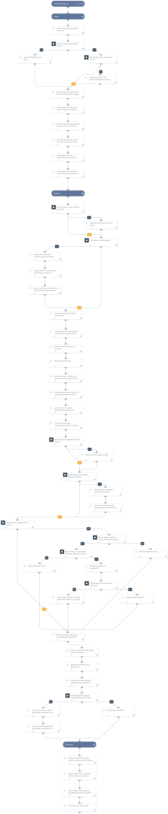

Lost or Stolen Devices may contain sensitive corporate information that can be exposed and lead to further unwanted malicious activity against your organization. Handling such an alert or incident requires multiple triage, response and mitigation steps involving different teams, 3rd parties service providers and security/IT products.
With this content pack, you can significantly reduce the time your security analysts spend on lost or stolen device alerts and standardize the way you manage lost or stolen device incidents.

##### What does this pack do?
The playbooks included in this pack guides you manually through the necessary tasks to remediate a lost or stolen device:

- Enrich device, owner and involved personal information, report the device to authorities.
- Determine if device lockdown is possible, and if the device is a mobile phone to contact the mobile service provider.
- Change/Revoke any personal information relevant to the device, bank accounts, AD account, passwords, VPN credentials, etc.
- Determine if remote wiping is supported by the device, if so follow the business logic to determine if remote wiping is applicable.
- Revoke the device from the organization's domain, approved lists, and add to appropriate block lists.
- For the final steps of the playbook, it will guide the analyst to retrieve more information from the owner, open a ticket for a new device, and issue a report to be shared   with the CISO.

_For more information, visit our [Cortex XSOAR Developer Docs](https://xsoar.pan.dev/docs/reference/playbooks/playbook8)_

