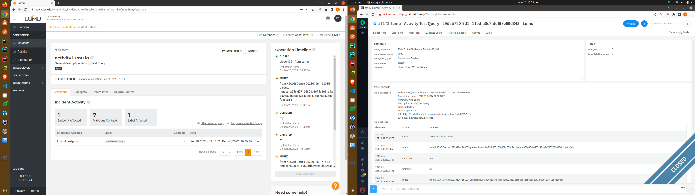

## Cortex - XSOAR and LUMU Integration

SecOps operations, reflect and manage the Lumu Incidents either from XSOAR Cortex or viceversa using the mirroring integration flow, https://lumu.io/

#### Diagram


#### Lumu API Specifications

here the short list of the http endpoint used in the Cortex-Lumu Integration
* [Consult incidents updates through REST](https://docs.lumu.io/portal/en/kb/articles/core-concepts-api#Consult_incidents_updates_through_REST)
* [Retrieve labels  [Available for Insights]](https://docs.lumu.io/portal/en/kb/articles/core-concepts-api#Retrieve_labels___Available_for_Insights)
* [Retrieve a specific label  [Available for Insights]](https://docs.lumu.io/portal/en/kb/articles/core-concepts-api#Retrieve_a_specific_label___Available_for_Insights)
* [Retrieve Incidents](https://docs.lumu.io/portal/en/kb/articles/core-concepts-api#Retrieve_Incidents)
* [Retrieve a specific Incident details  [Available for Insights]](https://docs.lumu.io/portal/en/kb/articles/core-concepts-api#Retrieve_a_specific_Incident_details___Available_for_Insights)
* [Retrieve a specific Incident context](https://docs.lumu.io/portal/en/kb/articles/core-concepts-api#Retrieve_a_specific_Incident_context)
* [Comment a specific incident  [Available for Insights]](https://docs.lumu.io/portal/en/kb/articles/core-concepts-api#Comment_a_specific_incident___Available_for_Insights)
* [Retrieve open incidents  [Available for Insights]](https://docs.lumu.io/portal/en/kb/articles/core-concepts-api#Retrieve_open_incidents____Available_for_Insights)
* [Retrieve muted incidents  [Available for Insights]](https://docs.lumu.io/portal/en/kb/articles/core-concepts-api#Retrieve_muted_incidents___Available_for_Insights)
* [Retrieve closed incidents](https://docs.lumu.io/portal/en/kb/articles/core-concepts-api#Retrieve_closed_incidents)
* [Retrieve endpoints by incident  [Available for Insights]](https://docs.lumu.io/portal/en/kb/articles/core-concepts-api#Retrieve_endpoints_by_incident___Available_for_Insights)
* [Mark incident as read  [Available for Insights]](https://docs.lumu.io/portal/en/kb/articles/core-concepts-api#Mark_incident_as_read___Available_for_Insights)
* [Mute incident  [Available for Insights]](https://docs.lumu.io/portal/en/kb/articles/core-concepts-api#Mute_incident___Available_for_Insights)
* [Unmute incident  [Available for Insights]](https://docs.lumu.io/portal/en/kb/articles/core-concepts-api#Unmute_incident___Available_for_Insights)
* [Close incident  [Available for Insights]](https://docs.lumu.io/portal/en/kb/articles/core-concepts-api#Close_incident___Available_for_Insights)

#### Operation

##### Marketplace


##### Configure: Set Off the integration

- Prerequisites
  - Lumu Defender Api key (company-key) `[required]`
  - Lumu access to request the Lumu API Endpoints, [Lumu API Specifications](https://docs.lumu.io/portal/en/kb/articles/core-concepts-api), [**Lumu Insights**](https://lumu.io/pricing/)
  - the Offset number to consult the latest updates as of the offset, [check API endpoint](https://docs.lumu.io/portal/en/kb/articles/core-concepts-api#Consult_incidents_updates_through_REST) `[required]`

Once the Lumu package was downloaded from the Cortex Marketplace, then next the Lumu integration initialization

- from the left panel select the `gear` settings, go to `Integrations` Tab and `Instances`, Sub-tab, search for **Lumu** and add a new instance.
    
    <br>

- Instance Settings
  - Parameters
    - _Name_ `[required]`
    - _Fetches incidents_ checked `[required]`
    - _Lumu_ Classifier `[required]`
    - _Lumu_ Incident type `[required]`
    - _LumuInMap_ Mapper (incoming) `[required]`
    -  `Mapper (outgoing)` ignore.
    -  `Maximum number of incidents to fetch every time` ignore
    -  `First fetch time interval` ignore
    -  _Server URL_ `[required]`
    -  `Proxy settings` optional
    -  `Trust any certificate` optional
    -  _API Key_ `[required]`
    -  _Incident Offset_ `[required]`
    -  _Incident Mirror Direction_ - select `Incoming and Outgoing` `[required]`
    -  `Mirror Tags`, do not change
    -  `Do not use by default` ignore
    -  _Log Level_ - select `debug or None` as it needs `[required]`
 -  Submit
    -  Click `Test` button and expect the green successful output.
    -  Submit the setup, click `Save and Exit`
    
    


##### Dashboard: Incident list

- These two are the main windows to list, select and check the Lumu incidents which have been mirrored for the Lumu integration in Cortex
    > Note: Lumu Portal to the left screen and Cortex to the right screen.

    
    <br>


##### Creation & Update Incident

- Mirroring process run in background and trigger each x time interval the commands which are required to successful sync both security platforms

    - Creation
    > Note: Cortex to the left screen and Lumu Portal to the right screen.

    
    <br>

    - Updates
    > Note: Cortex to the left screen and Lumu Portal to the right screen.

    
    <br>


##### Comment Incident

- Comment an incident from Cortex XSOAR
    > Note: Cortex to the left screen and Lumu Portal to the right screen.

    - hover and click in the comment field to edit, overwrite the new comment and click on the `ok` icon.
    `wait 1 minute tops until the changes are mirrored`
        
        <br>

-  Comment an incident from Lumu Portal
    > Note: Lumu Portal to the left screen and Cortex to the right screen.

    - click in **Take Actions** button, go to `Comment`, fill in the text box field  and submit the form.
    `wait 1 minute tops until the changes are mirrored`
        
        <br>


##### Mute Incident

- Mute an incident from Cortex XSOAR
    > Note: Cortex to the left screen and Lumu Portal to the right screen.

    - hover and click in the `comment` field to edit, overwrite the new comment and click on the `ok` icon.
    - hover and click in the `lumu_status` field to edit, overwrite the field typing `mute` or `muted` magic words and click on the `ok` icon.
    `wait 1 minute tops until the changes are mirrored`
        
        <br>

-  Mute an incident from Lumu Portal
    > Note: Lumu Portal to the left screen and Cortex to the right screen.

    - click in **Take Actions** button, go to `Mute`, fill in the text box field  and submit the form.
    `wait 1 minute tops until the changes are mirrored`
        
        <br>


##### Unmute (resume)  Incident

- Unmute an incident from Cortex XSOAR
    > Note: Cortex to the left screen and Lumu Portal to the right screen.

    - hover and click in the `comment` field to edit, overwrite the new comment and click on the `ok` icon.
    - hover and click in the `lumu_status` field to edit, overwrite the field typing `unmute` or `unmuted` magic words and click on the `ok` icon.
    `wait 1 minute tops until the changes are mirrored`
        
        <br>

-  Unmute an incident from Lumu Portal
    > Note: Lumu Portal to the left screen and Cortex to the right screen.

    - click in **Take Actions** button, go to `Unmute`, fill in the text box field  and submit the form.
    `wait 1 minute tops until the changes are mirrored`
        
        <br>


##### Close Incident

- Closing an incident from Cortex XSOAR
    > Note: Cortex to the left screen and Lumu Portal to the right screen.

    - click in **Actions** button, fill in the `Close Reason` and yhe `Close Notes` fields and submit the form.

        
        <br>
    - Incident closed in both sides triggered by Cortex side.
        `wait 1 minute tops until the changes are mirrored`
        
        <br>

-  Closing an incident from Lumu Portal
    > Note: Lumu Portal to the left screen and Cortex to the right screen.

    - click in **Take Actions** button, go to `Close Incident`, fill in the text box field  and submit the form.
        
        <br>
    - Incident closed in both sides triggered by Cortex side.
        `wait 1 minute tops until the changes are mirrored`
        
        <br>


##### Logs

- War Room
    it is a kind a CLI where you can crank manual command and check the entries of the integration.
    
    <br>

- Check the fetch history
    it is a table which print every `fetch-incidents` command execution and show the output data result.
    
    <br>

- integration-instance.log (ssh)

```bash
[root@cortex ~]# tail -f /var/log/demisto/integration-instance.log
2023-01-26 22:12:03.6217 debug (Lumu_instance_15_Lumu_fetch-incidents) Ignoring Message (IncidentMuted - 17af99e0-9b70-11ed-980e-915fb2011ca7) from Cortex to not create a loop between both parties (source: /builds/GOPATH/src/gitlab.xdr.pan.local/xdr/xsoar/server/services/automation/dockercoderunner.go:992)
2023-01-26 22:12:03.6219 debug (Lumu_instance_15_Lumu_fetch-incidents) Ignoring Message (IncidentUnmuted - 17af99e0-9b70-11ed-980e-915fb2011ca7) from Cortex to not create a loop between both parties (source: /builds/GOPATH/src/gitlab.xdr.pan.local/xdr/xsoar/server/services/automation/dockercoderunner.go:992)
2023-01-26 22:12:03.6224 debug (Lumu_instance_15_Lumu_fetch-incidents) Ignoring Message (IncidentMuted - f563af00-9bda-11ed-a0c7-dd6f8e69d343) from Cortex to not create a loop between both parties (source: /builds/GOPATH/src/gitlab.xdr.pan.local/xdr/xsoar/server/services/automation/dockercoderunner.go:992)
2023-01-26 22:12:03.6226 debug (Lumu_instance_15_Lumu_fetch-incidents) Ignoring Message (IncidentUnmuted - f563af00-9bda-11ed-a0c7-dd6f8e69d343) from Cortex to not create a loop between both parties (source: /builds/GOPATH/src/gitlab.xdr.pan.local/xdr/xsoar/server/services/automation/dockercoderunner.go:992)
2023-01-26 22:12:03.6229 debug (Lumu_instance_15_Lumu_fetch-incidents) Ignoring Message (IncidentMuted - f563af00-9bda-11ed-a0c7-dd6f8e69d343) from Cortex to not create a loop between both parties (source: /builds/GOPATH/src/gitlab.xdr.pan.local/xdr/xsoar/server/services/automation/dockercoderunner.go:992)
2023-01-26 22:12:03.6232 debug (Lumu_instance_15_Lumu_fetch-incidents) Ignoring Message (IncidentUnmuted - f563af00-9bda-11ed-a0c7-dd6f8e69d343) from Cortex to not create a loop between both parties (source: /builds/GOPATH/src/gitlab.xdr.pan.local/xdr/xsoar/server/services/automation/dockercoderunner.go:992)
2023-01-26 22:12:03.6239 debug (Lumu_instance_15_Lumu_fetch-incidents) There are 1 events queued ready to process their updates (source: /builds/GOPATH/src/gitlab.xdr.pan.local/xdr/xsoar/server/services/automation/dockercoderunner.go:992)
2023-01-26 22:12:03.6242 debug (Lumu_instance_15_Lumu_fetch-incidents) Setting integration context (source: /builds/GOPATH/src/gitlab.xdr.pan.local/xdr/xsoar/server/services/automation/dockercoderunner.go:992)
2023-01-26 22:12:03.6244 debug (Lumu_instance_15_Lumu_fetch-incidents) Updating integration context with version -1. Sync: True (source: /builds/GOPATH/src/gitlab.xdr.pan.local/xdr/xsoar/server/services/automation/dockercoderunner.go:992)
2023-01-26 22:12:03.6312 debug (Lumu_instance_15_Lumu_fetch-incidents) total inc found: 3, count=Counter({'17af99e0-9b70-11ed-980e-915fb2011ca7': 1, '2bc88020-9b2c-11ed-980e-915fb2011ca7': 1, 'f563af00-9bda-11ed-a0c7-dd6f8e69d343': 1}) last_run={} next_run={'last_fetch': '1091141'} (source: /builds/GOPATH/src/gitlab.xdr.pan.local/xdr/xsoar/server/services/automation/dockercoderunner.go:992)

```


---
[View Integration Documentation](https://xsoar.pan.dev/docs/reference/integrations/lumu)