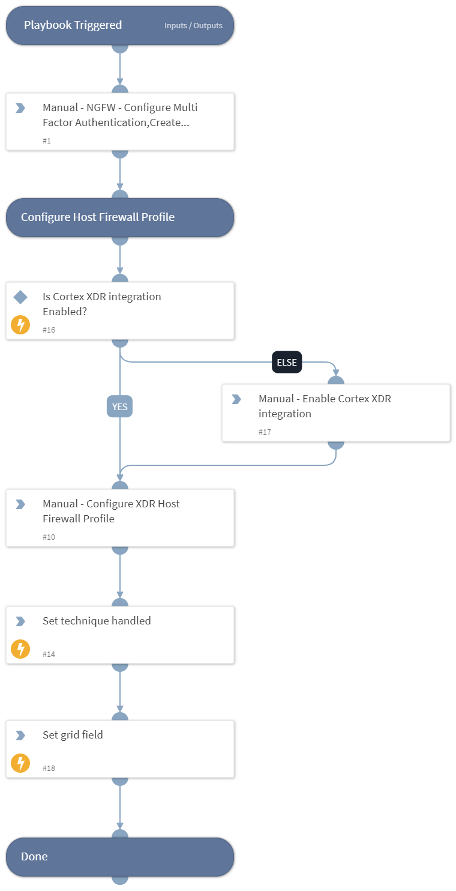

This playbook Remediates the Remote Desktop Protocol technique using intelligence-driven Courses of Action (COA) defined by Palo Alto Networks Unit 42 team.
 
***Disclaimer: This playbook does not simulate an attack using the specified technique, but follows the steps to remediation as defined by Palo Alto Networks Unit 42 team’s Actionable Threat Objects and Mitigations (ATOMs).
Techniques Handled:
- T1021.001: Remote Desktop Protocol

Kill Chain phases:
- Lateral Movement

MITRE ATT&CK Description:

Adversaries may use Valid Accounts to log into a computer using the Remote Desktop Protocol (RDP). The adversary may then perform actions as the logged-on user.

Remote desktop is a common feature in operating systems. It allows a user to log into an interactive session with a system desktop graphical user interface on a remote system. Microsoft refers to its implementation of the Remote Desktop Protocol (RDP) as Remote Desktop Services (RDS).

Adversaries may connect to a remote system over RDP/RDS to expand access if the service is enabled and allows access to accounts with known credentials. Adversaries will likely use Credential Access techniques to acquire credentials to use with RDP. Adversaries may also use RDP in conjunction with the Accessibility Features technique for Persistence.

Possible playbook uses:
- The playbook can be used independently to handle and remediate the specific technique.
- The playbook can be used as a part of the “Courses of Action - Defense Evasion” playbook to remediate techniques based on the kill chain phase.
- The playbook can be used as a part of the “MITRE ATT&CK - Courses of Action” playbook, which can be triggered by different sources and accepts the technique MITRE ATT&CK ID as an input.

## Dependencies
This playbook uses the following sub-playbooks, integrations, and scripts.

### Sub-playbooks
This playbook does not use any sub-playbooks.

### Integrations
This playbook does not use any integrations.

### Scripts
* IsIntegrationAvailable
* SetGridField
* Set

### Commands
This playbook does not use any commands.

## Playbook Inputs
---
There are no inputs for this playbook.

## Playbook Outputs
---

| **Path** | **Description** | **Type** |
| --- | --- | --- |
| Handled.Techniques | The technique handled in this playbook | string |

## Playbook Image
---
