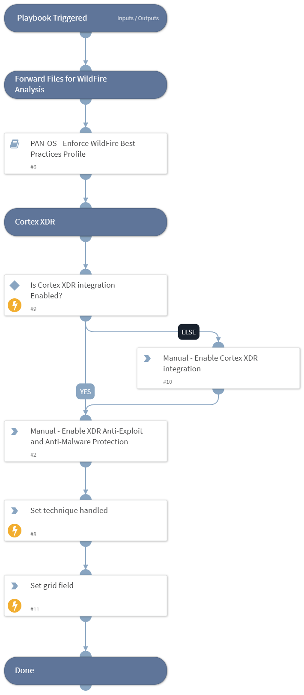

This playbook Remediates the Obfuscated Files or Information technique using intelligence-driven Courses of Action (COA) defined by Palo Alto Networks Unit 42 team.
 
***Disclaimer: This playbook does not simulate an attack using the specified technique, but follows the steps to remediation as defined by Palo Alto Networks Unit 42 team’s Actionable Threat Objects and Mitigations (ATOMs).
Techniques Handled:
- T1027: Obfuscated Files or Information

Kill Chain phases:
- Defense Evasion

MITRE ATT&CK Description:

Adversaries may attempt to make an executable or file difficult to discover or analyze by encrypting, encoding, or otherwise obfuscating its contents on the system or in transit. This is common behavior that can be used across different platforms and the network to evade defenses.

Possible playbook uses:
- The playbook can be used independently to handle and remediate the specific technique.
- The playbook can be used as a part of the “Courses of Action - Defense Evasion” playbook to remediate techniques based on the kill chain phase.
- The playbook can be used as a part of the “MITRE ATT&CK - Courses of Action” playbook, which can be triggered by different sources and accepts the technique MITRE ATT&CK ID as an input.

## Dependencies
This playbook uses the following sub-playbooks, integrations, and scripts.

### Sub-playbooks
* PAN-OS - Enforce WildFire Best Practices Profile

### Integrations
This playbook does not use any integrations.

### Scripts
* Set
* SetGridField
* IsIntegrationAvailable

### Commands
This playbook does not use any commands.

## Playbook Inputs
---

| **Name** | **Description** | **Default Value** | **Required** |
| --- | --- | --- | --- |
| template | Template name to enforce WildFire best practices profile. |  | Optional |
| pre_post | Rules location. Can be 'pre-rulebase' or 'post-rulebase'. Mandatory for Panorama instances. |  | Optional |
| device-group | The device group for which to return addresses \(Panorama instances\). |  | Optional |
| tag | Tag for which to filter the results. |  | Optional |

## Playbook Outputs
---

| **Path** | **Description** | **Type** |
| --- | --- | --- |
| Handled.Techniques | The technique handled in this playbook | unknown |

## Playbook Image
---
