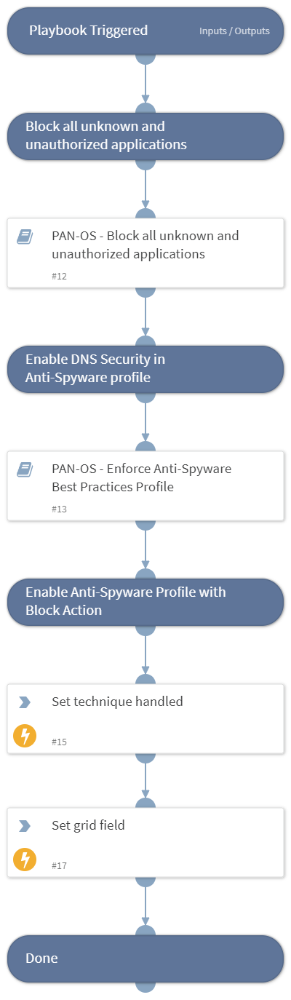

This playbook Remediates the Exfiltration Over C2 Channel technique using intelligence-driven Courses of Action (COA) defined by Palo Alto Networks Unit 42 team.
 
***Disclaimer: This playbook does not simulate an attack using the specified technique, but follows the steps to remediation as defined by Palo Alto Networks Unit 42 team’s Actionable Threat Objects and Mitigations (ATOMs).
Techniques Handled:
- T1041: Exfiltration Over C2 Channel

Kill Chain phases:
- Exfiltration

MITRE ATT&CK Description:
Adversaries may steal data by exfiltrating it over an existing command and control channel. Stolen data is encoded into the normal communications channel using the same protocol as command and control communications.

Possible playbook uses:
- The playbook can be used independently to handle and remediate the specific technique.
- The playbook can be used as a part of the “Courses of Action - Defense Evasion” playbook to remediate techniques based on the kill chain phase.
- The playbook can be used as a part of the “MITRE ATT&CK - Courses of Action” playbook, which can be triggered by different sources and accepts the technique MITRE ATT&CK ID as an input.

## Dependencies
This playbook uses the following sub-playbooks, integrations, and scripts.

### Sub-playbooks
* PAN-OS - Block all unknown and unauthorized applications
* PAN-OS - Enforce Anti-Spyware Best Practices Profile

### Integrations
This playbook does not use any integrations.

### Scripts
* SetGridField
* Set

### Commands
This playbook does not use any commands.

## Playbook Inputs
---

| **Name** | **Description** | **Default Value** | **Required** |
| --- | --- | --- | --- |
| pre_post | Rules location. Can be 'pre-rulebase' or 'post-rulebase'. Mandatory for Panorama instances. |  | Optional |
| device-group | The device group for which to return addresses \(Panorama instances\). |  | Optional |
| tag | Tag for which to filter the rules. |  | Optional |

## Playbook Outputs
---

| **Path** | **Description** | **Type** |
| --- | --- | --- |
| Handled.Techniques | The techniques handled in this playbook | unknown |

## Playbook Image
---
