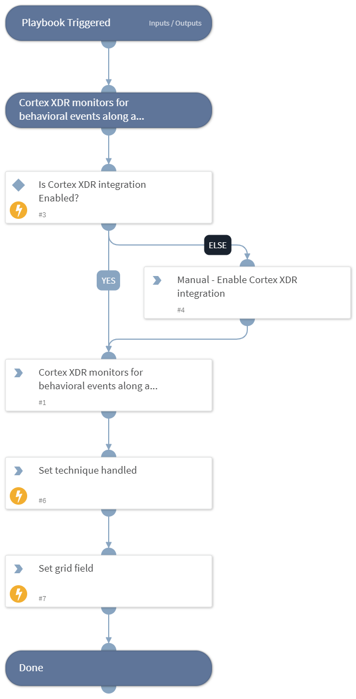

This playbook Remediates the Process Discovery technique using intelligence-driven Courses of Action (COA) defined by Palo Alto Networks Unit 42 team.
 
***Disclaimer: This playbook does not simulate an attack using the specified technique, but follows the steps to remediation as defined by Palo Alto Networks Unit 42 team’s Actionable Threat Objects and Mitigations (ATOMs).
Techniques Handled:
- T1057: Process Discovery

Kill Chain phases:
- Discovery

MITRE ATT&CK Description:

Adversaries may attempt to get information about running processes on a system. Information obtained could be used to gain an understanding of common software/applications running on systems within the network. Adversaries may use the information from Process Discovery during automated discovery to shape follow-on behaviors, including whether or not the adversary fully infects the target and/or attempts specific actions.

Possible playbook uses:
- The playbook can be used independently to handle and remediate the specific technique.
- The playbook can be used as a part of the “Courses of Action - Defense Evasion” playbook to remediate techniques based on the kill chain phase.
- The playbook can be used as a part of the “MITRE ATT&CK - Courses of Action” playbook, which can be triggered by different sources and accepts the technique MITRE ATT&CK ID as an input.

## Dependencies
This playbook uses the following sub-playbooks, integrations, and scripts.

### Sub-playbooks
This playbook does not use any sub-playbooks.

### Integrations
This playbook does not use any integrations.

### Scripts
* IsIntegrationAvailable
* Set
* SetGridField

### Commands
This playbook does not use any commands.

## Playbook Inputs
---
There are no inputs for this playbook.

## Playbook Outputs
---

| **Path** | **Description** | **Type** |
| --- | --- | --- |
| Handled.Techniques | The techniques handled in this playbook | unknown |

## Playbook Image
---
