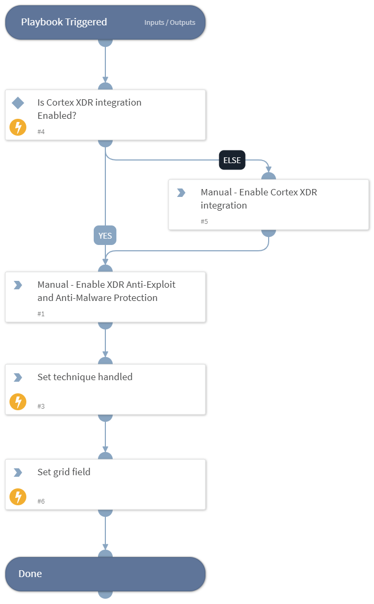

This playbook Remediates the Command and Scripting Interpreter technique using intelligence-driven Courses of Action (COA) defined by Palo Alto Networks Unit 42 team.
 
***Disclaimer: This playbook does not simulate an attack using the specified technique, but follows the steps to remediation as defined by Palo Alto Networks Unit 42 team’s Actionable Threat Objects and Mitigations (ATOMs).
Techniques Handled:
- T1059.001: Command and Scripting Interpreter: PowerShell

Kill Chain phases:
- Execution

MITRE ATT&CK Description:

Adversaries may abuse PowerShell commands and scripts for execution. PowerShell is a powerful interactive command-line interface and scripting environment included in the Windows operating system. [1] Adversaries can use PowerShell to perform a number of actions, including discovery of information and execution of code. Examples include the Start-Process cmdlet which can be used to run an executable and the Invoke-Command cmdlet which runs a command locally or on a remote computer (though administrator permissions are required to use PowerShell to connect to remote systems).

PowerShell may also be used to download and run executables from the Internet, which can be executed from disk or in memory without touching disk.

Possible playbook uses:
- The playbook can be used independently to handle and remediate the specific technique.
- The playbook can be used as a part of the “Courses of Action - Defense Evasion” playbook to remediate techniques based on the kill chain phase.
- The playbook can be used as a part of the “MITRE ATT&CK - Courses of Action” playbook, which can be triggered by different sources and accepts the technique MITRE ATT&CK ID as an input.

## Dependencies
This playbook uses the following sub-playbooks, integrations, and scripts.

### Sub-playbooks
This playbook does not use any sub-playbooks.

### Integrations
This playbook does not use any integrations.

### Scripts
* Set
* IsIntegrationAvailable
* SetGridField

### Commands
This playbook does not use any commands.

## Playbook Inputs
---
There are no inputs for this playbook.

## Playbook Outputs
---

| **Path** | **Description** | **Type** |
| --- | --- | --- |
| Handled.Techniques | The techniques handled in this playbook | unknown |

## Playbook Image
---
