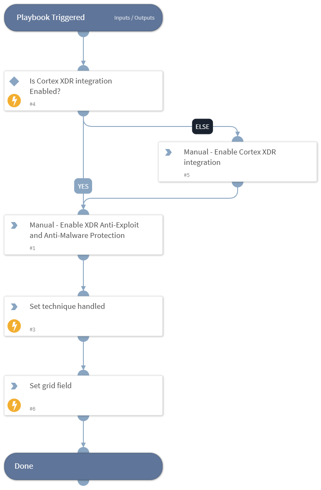

This playbook Remediates the Exploitation for Privilege Escalation technique using intelligence-driven Courses of Action (COA) defined by Palo Alto Networks Unit 42 team.
 
***Disclaimer: This playbook does not simulate an attack using the specified technique, but follows the steps to remediation as defined by Palo Alto Networks Unit 42 team’s Actionable Threat Objects and Mitigations (ATOMs).
Techniques Handled:
- T1068: Exploitation for Privilege Escalation

Kill Chain phases:
- Privilege Escalation

MITRE ATT&CK Description:
Adversaries may exploit software vulnerabilities in an attempt to collect elevate privileges. Exploitation of a software vulnerability occurs when an adversary takes advantage of a programming error in a program, service, or within the operating system software or kernel itself to execute adversary-controlled code. Security constructs such as permission levels will often hinder access to information and use of certain techniques, so adversaries will likely need to perform privilege escalation to include use of software exploitation to circumvent those restrictions.

When initially gaining access to a system, an adversary may be operating within a lower privileged process which will prevent them from accessing certain resources on the system. Vulnerabilities may exist, usually in operating system components and software commonly running at higher permissions, that can be exploited to gain higher levels of access on the system. This could enable someone to move from unprivileged or user level permissions to SYSTEM or root permissions depending on the component that is vulnerable. This may be a necessary step for an adversary compromising a endpoint system that has been properly configured and limits other privilege escalation methods.

Possible playbook uses:
- The playbook can be used independently to handle and remediate the specific technique.
- The playbook can be used as a part of the “Courses of Action - Defense Evasion” playbook to remediate techniques based on the kill chain phase.
- The playbook can be used as a part of the “MITRE ATT&CK - Courses of Action” playbook, which can be triggered by different sources and accepts the technique MITRE ATT&CK ID as an input.

## Dependencies
This playbook uses the following sub-playbooks, integrations, and scripts.

### Sub-playbooks
This playbook does not use any sub-playbooks.

### Integrations
This playbook does not use any integrations.

### Scripts
* Set
* IsIntegrationAvailable
* SetGridField

### Commands
This playbook does not use any commands.

## Playbook Inputs
---
There are no inputs for this playbook.

## Playbook Outputs
---

| **Path** | **Description** | **Type** |
| --- | --- | --- |
| Handled.Techniques | The techniques handled in this playbook | unknown |

## Playbook Image
---
