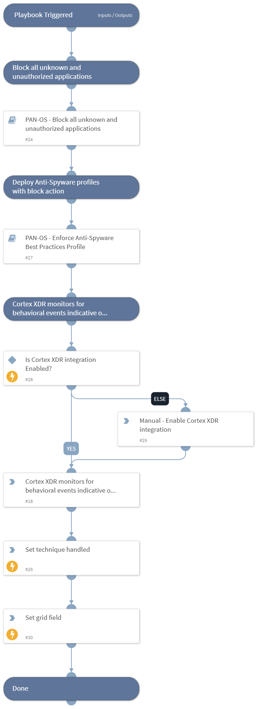

This playbook Remediates the Application Layer Protocol technique using intelligence-driven Courses of Action (COA) defined by Palo Alto Networks Unit 42 team.
 
***Disclaimer: This playbook does not simulate an attack using the specified technique, but follows the steps to remediation as defined by Palo Alto Networks Unit 42 team’s Actionable Threat Objects and Mitigations (ATOMs).
Techniques Handled:
- T1071: Application Layer Protocol

Kill Chain phases:
- Command And Control

MITRE ATT&CK Description:

Adversaries may communicate using application layer protocols to avoid detection/network filtering by blending in with existing traffic. Commands to the remote system, and often the results of those commands, will be embedded within the protocol traffic between the client and server.

Adversaries may utilize many different protocols, including those used for web browsing, transferring files, electronic mail, or DNS. For connections that occur internally within an enclave (such as those between a proxy or pivot node and other nodes), commonly used protocols are SMB, SSH, or RDP.

Possible playbook uses:
- The playbook can be used independently to handle and remediate the specific technique.
- The playbook can be used as a part of the “Courses of Action - Defense Evasion” playbook to remediate techniques based on the kill chain phase.
- The playbook can be used as a part of the “MITRE ATT&CK - Courses of Action” playbook, which can be triggered by different sources and accepts the technique MITRE ATT&CK ID as an input.

## Dependencies
This playbook uses the following sub-playbooks, integrations, and scripts.

### Sub-playbooks
* PAN-OS - Enforce Anti-Spyware Best Practices Profile
* PAN-OS - Block all unknown and unauthorized applications

### Integrations
This playbook does not use any integrations.

### Scripts
* Set
* SetGridField
* IsIntegrationAvailable

### Commands
This playbook does not use any commands.

## Playbook Inputs
---

| **Name** | **Description** | **Default Value** | **Required** |
| --- | --- | --- | --- |
| pre_post | Rules location. Can be 'pre-rulebase' or 'post-rulebase'. Mandatory for Panorama instances. |  | Optional |
| device-group | The device group for which to return addresses \(Panorama instances\). |  | Optional |
| tag | Tag for which to filter the rules. |  | Optional |

## Playbook Outputs
---

| **Path** | **Description** | **Type** |
| --- | --- | --- |
| Handled.Techniques | The techniques handled in this playbook | unknown |

## Playbook Image
---
