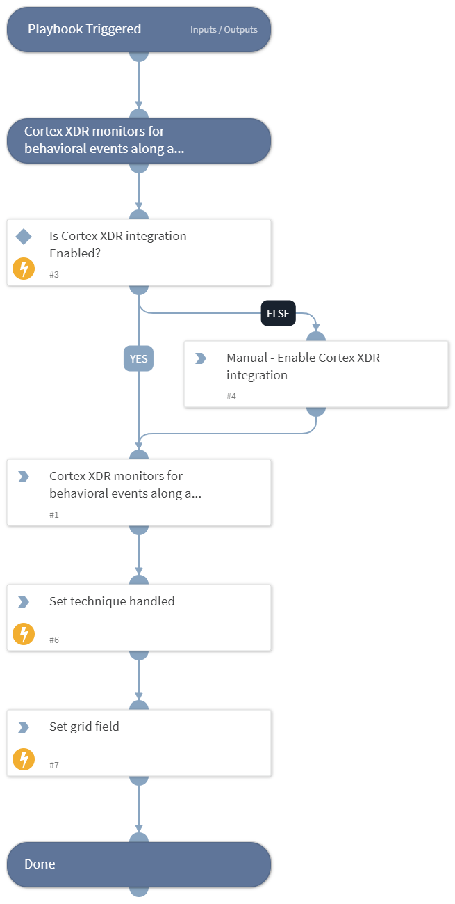

This playbook Remediates the File and Directory Discovery technique using intelligence-driven Courses of Action (COA) defined by Palo Alto Networks Unit 42 team.
 
***Disclaimer: This playbook does not simulate an attack using the specified technique, but follows the steps to remediation as defined by Palo Alto Networks Unit 42 team’s Actionable Threat Objects and Mitigations (ATOMs).
Techniques Handled:
- T1083: File and Directory Discovery

Kill Chain phases:
- Discovery

MITRE ATT&CK Description:

Adversaries may enumerate files and directories or may search in specific locations of a host or network share for certain information within a file system. Adversaries may use the information from File and Directory Discovery during automated discovery to shape follow-on behaviors, including whether or not the adversary fully infects the target and/or attempts specific actions.

Many command shell utilities can be used to obtain this information. Examples include dir, tree, ls, find, and locate.  Custom tools may also be used to gather file and directory information and interact with the Native API.

Possible playbook uses:
- The playbook can be used independently to handle and remediate the specific technique.
- The playbook can be used as a part of the “Courses of Action - Defense Evasion” playbook to remediate techniques based on the kill chain phase.
- The playbook can be used as a part of the “MITRE ATT&CK - Courses of Action” playbook, which can be triggered by different sources and accepts the technique MITRE ATT&CK ID as an input.

## Dependencies
This playbook uses the following sub-playbooks, integrations, and scripts.

### Sub-playbooks
This playbook does not use any sub-playbooks.

### Integrations
This playbook does not use any integrations.

### Scripts
* SetGridField
* IsIntegrationAvailable
* Set

### Commands
This playbook does not use any commands.

## Playbook Inputs
---
There are no inputs for this playbook.

## Playbook Outputs
---

| **Path** | **Description** | **Type** |
| --- | --- | --- |
| Handled.Techniques | The techniques handled in this playbook | unknown |

## Playbook Image
---
