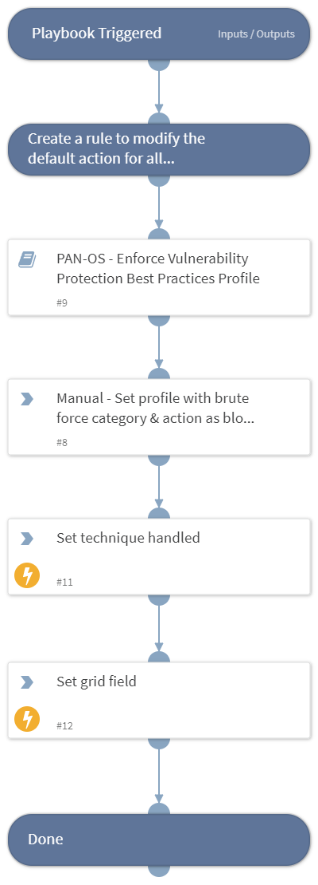

This playbook Remediates the Brute Force technique using intelligence-driven Courses of Action (COA) defined by Palo Alto Networks Unit 42 team.
 
***Disclaimer: This playbook does not simulate an attack using the specified technique, but follows the steps to remediation as defined by Palo Alto Networks Unit 42 team’s Actionable Threat Objects and Mitigations (ATOMs).
Techniques Handled:
- T1110 : Brute Force

Kill Chain phases:
- Credential Access

MITRE ATT&CK Description:

Adversaries may use brute force techniques to gain access to accounts when passwords are unknown or when password hashes are obtained. Without knowledge of the password for an account or set of accounts, an adversary may systematically guess the password using a repetitive or iterative mechanism. Brute forcing passwords can take place via interaction with a service that will check the validity of those credentials or offline against previously acquired credential data, such as password hashes.

Possible playbook uses:
- The playbook can be used independently to handle and remediate the specific technique.
- The playbook can be used as a part of the “Courses of Action - Defense Evasion” playbook to remediate techniques based on the kill chain phase.
- The playbook can be used as a part of the “MITRE ATT&CK - Courses of Action” playbook, which can be triggered by different sources and accepts the technique MITRE ATT&CK ID as an input.

## Dependencies
This playbook uses the following sub-playbooks, integrations, and scripts.

### Sub-playbooks
* PAN-OS - Enforce Vulnerability Protection Best Practices Profile

### Integrations
This playbook does not use any integrations.

### Scripts
* Set
* SetGridField

### Commands
This playbook does not use any commands.

## Playbook Inputs
---

| **Name** | **Description** | **Default Value** | **Required** |
| --- | --- | --- | --- |
| pre_post | Rules location. Can be 'pre-rulebase' or 'post-rulebase'. Mandatory for Panorama instances. |  | Optional |
| device-group | The device group for which to return addresses \(Panorama instances\). |  | Optional |
| tag | Tag for which to filter the results. |  | Optional |

## Playbook Outputs
---

| **Path** | **Description** | **Type** |
| --- | --- | --- |
| Handled.Techniques | The techniques handled in this playbook | unknown |

## Playbook Image
---
