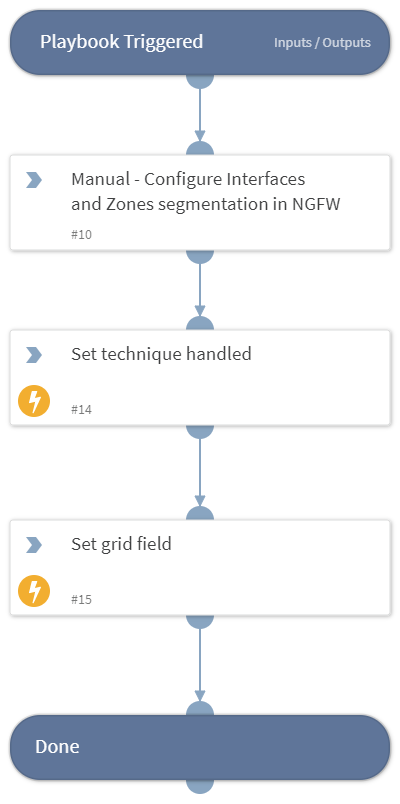

This playbook Remediates the Trusted Relationship technique using intelligence-driven Courses of Action (COA) defined by Palo Alto Networks Unit 42 team.
 
***Disclaimer: This playbook does not simulate an attack using the specified technique, but follows the steps to remediation as defined by Palo Alto Networks Unit 42 team’s Actionable Threat Objects and Mitigations (ATOMs).
Techniques Handled:
- T1199: Trusted Relationship

Kill Chain phases:
- Initial Access

MITRE ATT&CK Description:

Adversaries may breach or otherwise leverage organizations who have access to intended victims. Access through trusted third party relationship exploits an existing connection that may not be protected or receives less scrutiny than standard mechanisms of gaining access to a network.

Organizations often grant elevated access to second or third-party external providers in order to allow them to manage internal systems as well as cloud-based environments. Some examples of these relationships include IT services contractors, managed security providers, infrastructure contractors (e.g. HVAC, elevators, physical security). The third-party provider's access may be intended to be limited to the infrastructure being maintained, but may exist on the same network as the rest of the enterprise. As such, Valid Accounts used by the other party for access to internal network systems may be compromised and used.

Possible playbook uses:
- The playbook can be used independently to handle and remediate the specific technique.
- The playbook can be used as a part of the “Courses of Action - Defense Evasion” playbook to remediate techniques based on the kill chain phase.
- The playbook can be used as a part of the “MITRE ATT&CK - Courses of Action” playbook, which can be triggered by different sources and accepts the technique MITRE ATT&CK ID as an input.

## Dependencies
This playbook uses the following sub-playbooks, integrations, and scripts.

### Sub-playbooks
This playbook does not use any sub-playbooks.

### Integrations
This playbook does not use any integrations.

### Scripts
* Set
* SetGridField

### Commands
This playbook does not use any commands.

## Playbook Inputs
---
There are no inputs for this playbook.

## Playbook Outputs
---

| **Path** | **Description** | **Type** |
| --- | --- | --- |
| Handled.Techniques | The techniques handled in this playbook | string |

## Playbook Image
---
