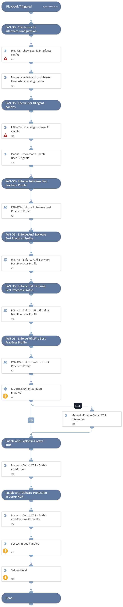

This playbook Remediates the User Execution technique using intelligence-driven Courses of Action (COA) defined by Palo Alto Networks Unit 42 team.
 
***Disclaimer: This playbook does not simulate an attack using the specified technique, but follows the steps to remediation as defined by Palo Alto Networks Unit 42 team’s Actionable Threat Objects and Mitigations (ATOMs).
Techniques Handled:
- T1204: User Execution

Kill Chain phases:
- Execution

MITRE ATT&CK Description:

An adversary may rely upon specific actions by a user in order to gain execution. Users may be subjected to social engineering to get them to execute malicious code by, for example, opening a malicious document file or link. These user actions will typically be observed as follow-on behavior from forms of Phishing.

While User Execution frequently occurs shortly after Initial Access it may occur at other phases of an intrusion, such as when an adversary places a file in a shared directory or on a user's desktop hoping that a user will click on it. This activity may also be seen shortly after Internal Spearphishing.

Possible playbook uses:
- The playbook can be used independently to handle and remediate the specific technique.
- The playbook can be used as a part of the “Courses of Action - Defense Evasion” playbook to remediate techniques based on the kill chain phase.
- The playbook can be used as a part of the “MITRE ATT&CK - Courses of Action” playbook, which can be triggered by different sources and accepts the technique MITRE ATT&CK ID as an input.  

## Dependencies
This playbook uses the following sub-playbooks, integrations, and scripts.

### Sub-playbooks
* PAN-OS - Enforce Anti-Virus Best Practices Profile
* PAN-OS - Enforce Anti-Spyware Best Practices Profile
* PAN-OS - Enforce URL Filtering Best Practices Profile
* PAN-OS - Enforce WildFire Best Practices Profile

### Integrations
* Panorama

### Scripts
* Set
* SetGridField
* IsIntegrationAvailable

### Commands
* pan-os-show-user-id-interfaces-config
* pan-os-list-configured-user-id-agents

## Playbook Inputs
---

| **Name** | **Description** | **Default Value** | **Required** |
| --- | --- | --- | --- |
| template | Template name to enforce WildFire best practices profile. |  | Optional |
| template_stack | The template stack to use when running the command. |  | Optional |
| vsys | The name of the virtual system to be configured. Will use the configured VSYS parameter if exists. If given a value, will override the VSYS parameter. If neither the VSYS parameter and this argument are entered, will default to 'vsys1'.  |  | Optional |
| device-group | The device group to work on. Exists only in panorama\! |  | Optional |
| tag | Tag for which to filter the results. |  | Optional |
| pre-post-rulebase | Determines whether the rule is a pre-rulebase or post-rulebase rule, according to the rule structure. Exists only in panorama\! |  | Optional |

## Playbook Outputs
---
There are no outputs for this playbook.

## Playbook Image
---
