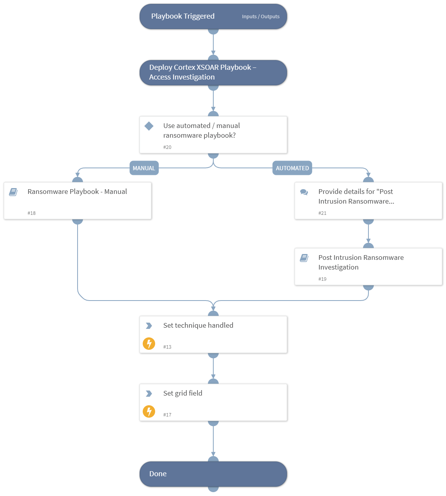

This playbook Remediates the Data Encrypted for Impact technique using intelligence-driven Courses of Action (COA) defined by Palo Alto Networks Unit 42 team.
 
***Disclaimer: This playbook does not simulate an attack using the specified technique, but follows the steps to remediation as defined by Palo Alto Networks Unit 42 team’s Actionable Threat Objects and Mitigations (ATOMs).
Techniques Handled:
- T1486: Data Encrypted for Impact

Kill Chain phases:
- Impact

MITRE ATT&CK Description:

Adversaries may encrypt data on target systems or on large numbers of systems in a network to interrupt availability to system and network resources. They can attempt to render stored data inaccessible by encrypting files or data on local and remote drives and withholding access to a decryption key. This may be done in order to extract monetary compensation from a victim in exchange for decryption or a decryption key (ransomware) or to render data permanently inaccessible in cases where the key is not saved or transmitted.[1][2][3][4] In the case of ransomware, it is typical that common user files like Office documents, PDFs, images, videos, audio, text, and source code files will be encrypted. In some cases, adversaries may encrypt critical system files, disk partitions, and the MBR.

To maximize impact on the target organization, malware designed for encrypting data may have worm-like features to propagate across a network by leveraging other attack techniques like Valid Accounts, OS Credential Dumping, and SMB/Windows Admin Shares.

Possible playbook uses:
- The playbook can be used independently to handle and remediate the specific technique.
- The playbook can be used as a part of the “Courses of Action - Defense Evasion” playbook to remediate techniques based on the kill chain phase.
- The playbook can be used as a part of the “MITRE ATT&CK - Courses of Action” playbook, which can be triggered by different sources and accepts the technique MITRE ATT&CK ID as an input.

## Dependencies
This playbook uses the following sub-playbooks, integrations, and scripts.

### Sub-playbooks
* Ransomware Playbook - Manual
* Post Intrusion Ransomware Investigation

### Integrations
This playbook does not use any integrations.

### Scripts
* Set
* SetGridField

### Commands
This playbook does not use any commands.

## Playbook Inputs
---
There are no inputs for this playbook.

## Playbook Outputs
---

| **Path** | **Description** | **Type** |
| --- | --- | --- |
| Handled.Techniques | The technique handled in this playbook | unknown |

## Playbook Image
---
