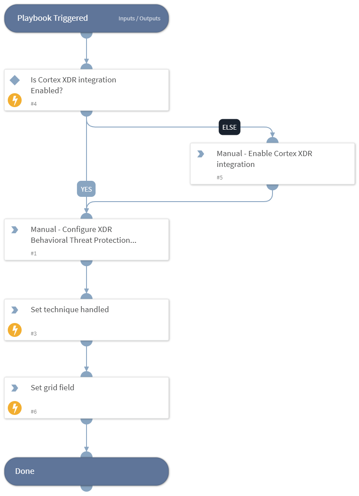

This playbook Remediates the Registry Run Keys / Startup Folder technique using intelligence-driven Courses of Action (COA) defined by Palo Alto Networks Unit 42 team.
 
***Disclaimer: This playbook does not simulate an attack using the specified technique, but follows the steps to remediation as defined by Palo Alto Networks Unit 42 team’s Actionable Threat Objects and Mitigations (ATOMs).
Techniques Handled:
- T1547.001: Boot or Logon Autostart Execution: Registry Run Keys / Startup Folder

Kill Chain phases:
- Persistence
- Privilege Escalation

MITRE ATT&CK Description:
Adversaries may achieve persistence by adding a program to a startup folder or referencing it with a Registry run key. Adding an entry to the "run keys" in the Registry or startup folder will cause the program referenced to be executed when a user logs in. [1] These programs will be executed under the context of the user and will have the account's associated permissions level.

Placing a program within a startup folder will also cause that program to execute when a user logs in. There is a startup folder location for individual user accounts as well as a system-wide startup folder that will be checked regardless of which user account logs in. The startup folder path for the current user is C:\Users[Username]\AppData\Roaming\Microsoft\Windows\Start Menu\Programs\Startup. The startup folder path for all users is C:\ProgramData\Microsoft\Windows\Start Menu\Programs\StartUp.

Possible playbook uses:
- The playbook can be used independently to handle and remediate the specific technique.
- The playbook can be used as a part of the “Courses of Action - Defense Evasion” playbook to remediate techniques based on the kill chain phase.
- The playbook can be used as a part of the “MITRE ATT&CK - Courses of Action” playbook, which can be triggered by different sources and accepts the technique MITRE ATT&CK ID as an input.

## Dependencies
This playbook uses the following sub-playbooks, integrations, and scripts.

### Sub-playbooks
This playbook does not use any sub-playbooks.

### Integrations
This playbook does not use any integrations.

### Scripts
* Set
* SetGridField
* IsIntegrationAvailable

### Commands
This playbook does not use any commands.

## Playbook Inputs
---
There are no inputs for this playbook.

## Playbook Outputs
---

| **Path** | **Description** | **Type** |
| --- | --- | --- |
| Handled.Techniques | The techniques handled in this playbook | unknown |

## Playbook Image
---
