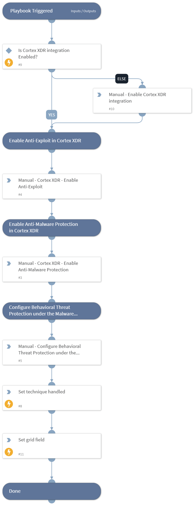

This playbook Remediates the Boot or Logon Autostart Execution technique using intelligence-driven Courses of Action (COA) defined by Palo Alto Networks Unit 42 team.
 
***Disclaimer: This playbook does not simulate an attack using the specified technique, but follows the steps to remediation as defined by Palo Alto Networks Unit 42 team’s Actionable Threat Objects and Mitigations (ATOMs).
Techniques Handled:
- T1547: Boot or Logon Autostart Execution

Kill Chain phases:
- Persistence
- Privilege Escalation

MITRE ATT&CK Description:

Adversaries may configure system settings to automatically execute a program during system boot or logon to maintain persistence or gain higher-level privileges on compromised systems. Operating systems may have mechanisms for automatically running a program on system boot or account logon.[1][2][3][4][5]  These mechanisms may include automatically executing programs that are placed in specially designated directories or are referenced by repositories that store configuration information, such as the Windows Registry. An adversary may achieve the same goal by modifying or extending features of the kernel.

Since some boot or logon autostart programs run with higher privileges, an adversary may leverage these to elevate privileges.

Possible playbook uses:
- The playbook can be used independently to handle and remediate the specific technique.
- The playbook can be used as a part of the “Courses of Action - Defense Evasion” playbook to remediate techniques based on the kill chain phase.
- The playbook can be used as a part of the “MITRE ATT&CK - Courses of Action” playbook, which can be triggered by different sources and accepts the technique MITRE ATT&CK ID as an input.

## Dependencies
This playbook uses the following sub-playbooks, integrations, and scripts.

### Sub-playbooks
This playbook does not use any sub-playbooks.

### Integrations
This playbook does not use any integrations.

### Scripts
* SetGridField
* IsIntegrationAvailable
* Set

### Commands
This playbook does not use any commands.

## Playbook Inputs
---
There are no inputs for this playbook.

## Playbook Outputs
---

| **Path** | **Description** | **Type** |
| --- | --- | --- |
| Handled.Techniques | The techniques handled in this playbook | unknown |

## Playbook Image
---
