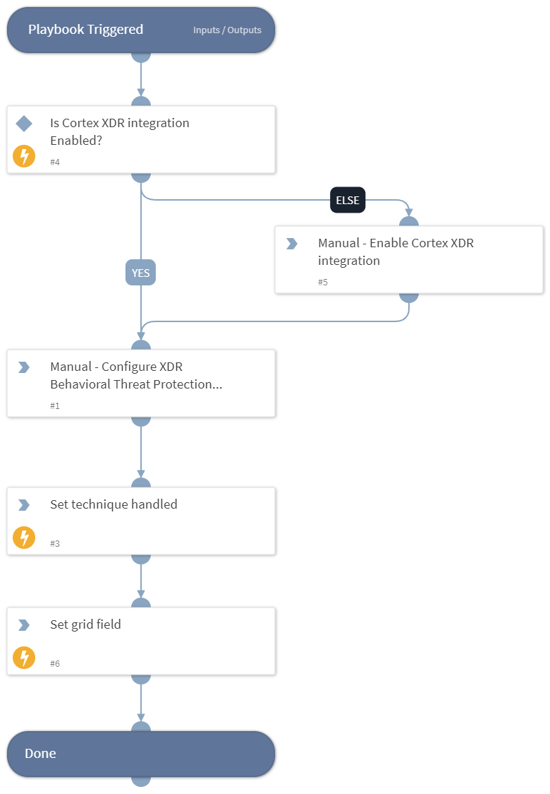

This playbook Remediates the Data Encrypted technique using intelligence-driven Courses of Action (COA) defined by Palo Alto Networks Unit 42 team.
 
***Disclaimer: This playbook does not simulate an attack using the specified technique, but follows the steps to remediation as defined by Palo Alto Networks Unit 42 team’s Actionable Threat Objects and Mitigations (ATOMs).
Techniques Handled:
- T1560.001: Archive Collected Data: Archive via Utility

Kill Chain phases:
- Exfiltration

MITRE ATT&CK Description:

An adversary may compress or encrypt data that is collected prior to exfiltration using 3rd party utilities. Many utilities exist that can archive data, including 7-Zip[1], WinRAR[2], and WinZip[3]. Most utilities include functionality to encrypt and/or compress data.

Some 3rd party utilities may be preinstalled, such as tar on Linux and macOS or zip on Windows systems.

Possible playbook uses:
- The playbook can be used independently to handle and remediate the specific technique.
- The playbook can be used as a part of the “Courses of Action - Defense Evasion” playbook to remediate techniques based on the kill chain phase.
- The playbook can be used as a part of the “MITRE ATT&CK - Courses of Action” playbook, which can be triggered by different sources and accepts the technique MITRE ATT&CK ID as an input.

## Dependencies
This playbook uses the following sub-playbooks, integrations, and scripts.

### Sub-playbooks
This playbook does not use any sub-playbooks.

### Integrations
This playbook does not use any integrations.

### Scripts
* IsIntegrationAvailable
* Set
* SetGridField

### Commands
This playbook does not use any commands.

## Playbook Inputs
---
There are no inputs for this playbook.

## Playbook Outputs
---

| **Path** | **Description** | **Type** |
| --- | --- | --- |
| Handled.Techniques | The techniques handled in this playbook | unknown |

## Playbook Image
---
