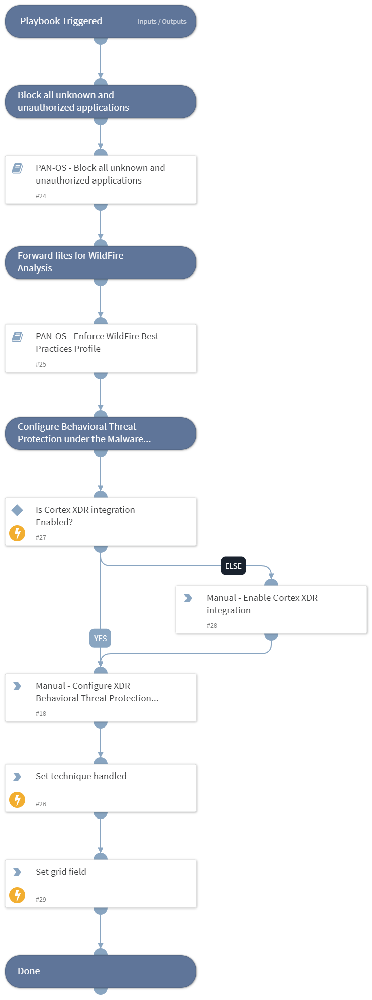

This playbook Remediates the NTFS File Attributes technique using intelligence-driven Courses of Action (COA) defined by Palo Alto Networks Unit 42 team.
 
***Disclaimer: This playbook does not simulate an attack using the specified technique, but follows the steps to remediation as defined by Palo Alto Networks Unit 42 team’s Actionable Threat Objects and Mitigations (ATOMs).
Techniques Handled:
- T1564.004: NTFS File Attributes

Kill Chain phases:
- Defense Evasion

MITRE ATT&CK Description:

Adversaries may use NTFS file attributes to hide their malicious data in order to evade detection. Every New Technology File System (NTFS) formatted partition contains a Master File Table (MFT) that maintains a record for every file/directory on the partition. [1] Within MFT entries are file attributes, [2] such as Extended Attributes (EA) and Data [known as Alternate Data Streams (ADSs) when more than one Data attribute is present], that can be used to store arbitrary data (and even complete files).

Adversaries may store malicious data or binaries in file attribute metadata instead of directly in files. This may be done to evade some defenses, such as static indicator scanning tools and anti-virus.

Possible playbook uses:
- The playbook can be used independently to handle and remediate the specific technique.
- The playbook can be used as a part of the “Courses of Action - Defense Evasion” playbook to remediate techniques based on the kill chain phase.
- The playbook can be used as a part of the “MITRE ATT&CK - Courses of Action” playbook, which can be triggered by different sources and accepts the technique MITRE ATT&CK ID as an input.

## Dependencies
This playbook uses the following sub-playbooks, integrations, and scripts.

### Sub-playbooks
* PAN-OS - Enforce WildFire Best Practices Profile
* PAN-OS - Block all unknown and unauthorized applications

### Integrations
This playbook does not use any integrations.

### Scripts
* IsIntegrationAvailable
* Set
* SetGridField

### Commands
This playbook does not use any commands.

## Playbook Inputs
---

| **Name** | **Description** | **Default Value** | **Required** |
| --- | --- | --- | --- |
| template | Template name to enforce WildFire best practices profile. |  | Optional |
| pre_post | Rules location. Can be 'pre-rulebase' or 'post-rulebase'. Mandatory for Panorama instances. |  | Optional |
| device-group | The device group for which to return addresses \(Panorama instances\). |  | Optional |
| tag | Tag for which to filter the rules. |  | Optional |

## Playbook Outputs
---

| **Path** | **Description** | **Type** |
| --- | --- | --- |
| Handled.Techniques | The techniques handled in this playbook | unknown |

## Playbook Image
---
