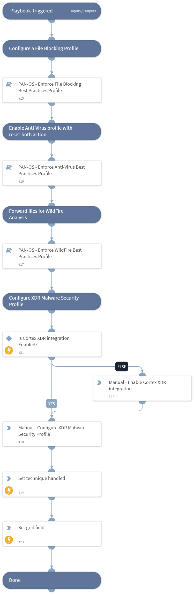

This playbook Remediates the Spear-Phishing Attachment technique using intelligence-driven Courses of Action (COA) defined by Palo Alto Networks Unit 42 team.
 
***Disclaimer: This playbook does not simulate an attack using the specified technique, but follows the steps to remediation as defined by Palo Alto Networks Unit 42 team’s Actionable Threat Objects and Mitigations (ATOMs).
Techniques Handled:
- T1566.001: Spear-Phishing Attachment

Kill Chain phases:
- Initial Access

MITRE ATT&CK Description:

Adversaries may send spearphishing emails with a malicious attachment in an attempt to gain access to victim systems. Spearphishing attachment is a specific variant of spearphishing. Spearphishing attachment is different from other forms of spearphishing in that it employs the use of malware attached to an email. All forms of spearphishing are electronically delivered social engineering targeted at a specific individual, company, or industry. In this scenario, adversaries attach a file to the spearphishing email and usually rely upon User Execution to gain execution.

Possible playbook uses:
- The playbook can be used independently to handle and remediate the specific technique.
- The playbook can be used as a part of the “Courses of Action - Defense Evasion” playbook to remediate techniques based on the kill chain phase.
- The playbook can be used as a part of the “MITRE ATT&CK - Courses of Action” playbook, which can be triggered by different sources and accepts the technique MITRE ATT&CK ID as an input.

## Dependencies
This playbook uses the following sub-playbooks, integrations, and scripts.

### Sub-playbooks
* PAN-OS - Enforce WildFire Best Practices Profile
* PAN-OS - Enforce File Blocking Best Practices Profile
* PAN-OS - Enforce Anti-Virus Best Practices Profile

### Integrations
This playbook does not use any integrations.

### Scripts
* Set
* SetGridField
* IsIntegrationAvailable

### Commands
This playbook does not use any commands.

## Playbook Inputs
---

| **Name** | **Description** | **Default Value** | **Required** |
| --- | --- | --- | --- |
| template | Template name to enforce WildFire best practices profile. |  | Optional |
| pre_post | Rules location. Can be 'pre-rulebase' or 'post-rulebase'. Mandatory for Panorama instances. |  | Optional |
| device-group | The device group for which to return addresses \(Panorama instances\). |  | Optional |
| tag | Tag for which to filter the results. |  | Optional |

## Playbook Outputs
---

| **Path** | **Description** | **Type** |
| --- | --- | --- |
| Handled.Techniques | The techniques handled in this playbook | string |

## Playbook Image
---
