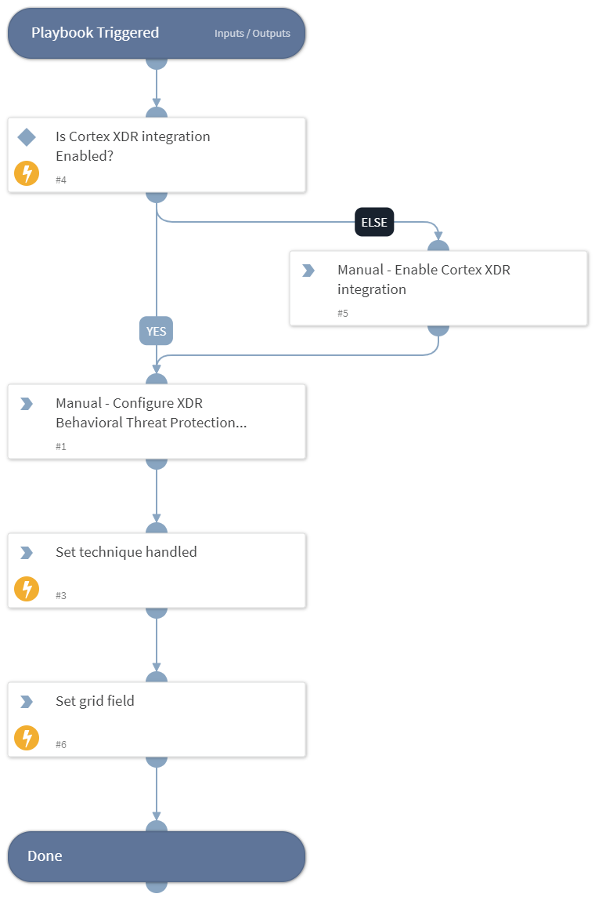

This playbook Remediates the Service Execution technique using intelligence-driven Courses of Action (COA) defined by Palo Alto Networks Unit 42 team.
 
***Disclaimer: This playbook does not simulate an attack using the specified technique, but follows the steps to remediation as defined by Palo Alto Networks Unit 42 team’s Actionable Threat Objects and Mitigations (ATOMs).
Techniques Handled:
- T1569.002: System Services: Service Execution

Kill Chain phases:
- Execution

MITRE ATT&CK Description:
Adversaries may abuse the Windows service control manager to execute malicious commands or payloads. The Windows service control manager (services.exe) is an interface to manage and manipulate services.[1] The service control manager is accessible to users via GUI components as well as system utilities such as sc.exe and Net.
PsExec can also be used to execute commands or payloads via a temporary Windows service created through the service control manager API.[2]
Adversaries may leverage these mechanisms to execute malicious content. This can be done by either executing a new or modified service. This technique is the execution used in conjunction with Windows Service during service persistence or privilege escalation.

Possible playbook uses:
- The playbook can be used independently to handle and remediate the specific technique.
- The playbook can be used as a part of the “Courses of Action - Defense Evasion” playbook to remediate techniques based on the kill chain phase.
- The playbook can be used as a part of the “MITRE ATT&CK - Courses of Action” playbook, which can be triggered by different sources and accepts the technique MITRE ATT&CK ID as an input.

## Dependencies
This playbook uses the following sub-playbooks, integrations, and scripts.

### Sub-playbooks
This playbook does not use any sub-playbooks.

### Integrations
This playbook does not use any integrations.

### Scripts
* IsIntegrationAvailable
* Set
* SetGridField

### Commands
This playbook does not use any commands.

## Playbook Inputs
---
There are no inputs for this playbook.

## Playbook Outputs
---

| **Path** | **Description** | **Type** |
| --- | --- | --- |
| Handled.Techniques | The techniques handled in this playbook | unknown |

## Playbook Image
---
