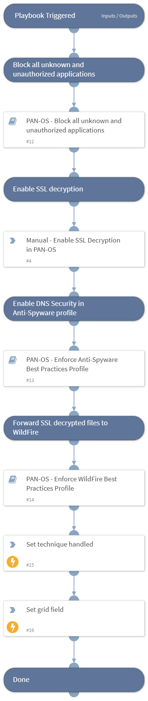

This playbook Remediates the Standard Cryptographic Protocol technique using intelligence-driven Courses of Action (COA) defined by Palo Alto Networks Unit 42 team.
 
***Disclaimer: This playbook does not simulate an attack using the specified technique, but follows the steps to remediation as defined by Palo Alto Networks Unit 42 team’s Actionable Threat Objects and Mitigations (ATOMs).
Techniques Handled:
- 1573.002: Encrypted Channel: Asymmetric Cryptography

Kill Chain phases:
- Command And Control

MITRE ATT&CK Description:
Adversaries may employ a known asymmetric encryption algorithm to conceal command and control traffic rather than relying on any inherent protections provided by a communication protocol. Asymmetric cryptography, also known as public key cryptography, uses a keypair per party: one public that can be freely distributed, and one private. Due to how the keys are generated, the sender encrypts data with the receiver’s public key and the receiver decrypts the data with their private key. This ensures that only the intended recipient can read the encrypted data. Common public key encryption algorithms include RSA and ElGamal.

For efficiency, may protocols (including SSL/TLS) use symmetric cryptography once a connection is established, but use asymmetric cryptography to establish or transmit a key. As such, these protocols are classified as Asymmetric Cryptography.

Possible playbook uses:
- The playbook can be used independently to handle and remediate the specific technique.
- The playbook can be used as a part of the “Courses of Action - Defense Evasion” playbook to remediate techniques based on the kill chain phase.
- The playbook can be used as a part of the “MITRE ATT&CK - Courses of Action” playbook, which can be triggered by different sources and accepts the technique MITRE ATT&CK ID as an input.

## Dependencies
This playbook uses the following sub-playbooks, integrations, and scripts.

### Sub-playbooks
* PAN-OS - Enforce WildFire Best Practices Profile
* PAN-OS - Block all unknown and unauthorized applications
* PAN-OS - Enforce Anti-Spyware Best Practices Profile

### Integrations
This playbook does not use any integrations.

### Scripts
* SetGridField
* Set

### Commands
This playbook does not use any commands.

## Playbook Inputs
---

| **Name** | **Description** | **Default Value** | **Required** |
| --- | --- | --- | --- |
| template | Template name to enforce WildFire best practices profile. |  | Optional |
| pre_post | Rules location. Can be 'pre-rulebase' or 'post-rulebase'. Mandatory for Panorama instances. |  | Optional |
| device-group | The device group for which to return addresses \(Panorama instances\). |  | Optional |
| tag | Tag for which to filter the rules. |  | Optional |

## Playbook Outputs
---

| **Path** | **Description** | **Type** |
| --- | --- | --- |
| Handled.Techniques | The techniques handled in this playbook | unknown |

## Playbook Image
---
