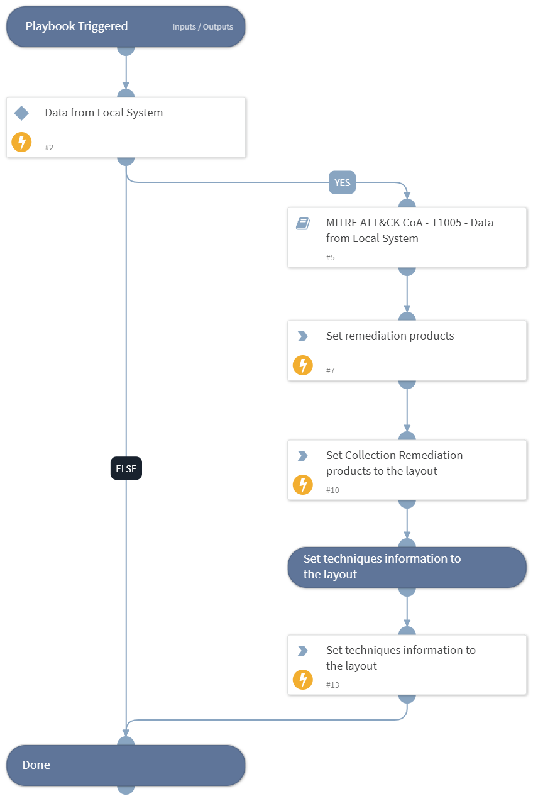

This playbook handles MITRE ATT&CK Techniques using intelligence-driven Courses of Action (COA) defined by Palo Alto Networks Unit 42 team.
 
***Disclaimer: This playbook does not simulate an attack using the specified techniques, but follows the steps to remediation as defined by Palo Alto Networks Unit 42 team’s Actionable Threat Objects and Mitigations (ATOMs).
 
Techniques Handled:
- T1005 - Data from Local System
- Kill Chain phase:
- Collection

MITRE ATT&CK Description: 
The adversary is attempting to gather data of interest to accomplish their goal.
 
Collection consists of techniques adversaries may use to gather information and the sources information is collected from that are relevant to following through on the adversary’s objectives. Frequently, the next goal after collecting data is to steal (exfiltrate) the data. Common target sources include various drive types, browsers, audio, video, and email. Common collection methods include capturing screenshots and keyboard input.

Possible playbook triggers:
- The playbook can be used as a part of the “Courses of Action - Collection” playbook to remediate techniques based on kill chain phase.
- The playbook can be used as a part of the “MITRE ATT&CK - Courses of Action” playbook, that can be triggered by different sources and accepts the technique MITRE ATT&CK ID as an input.

## Dependencies
This playbook uses the following sub-playbooks, integrations, and scripts.

### Sub-playbooks
* MITRE ATT&CK CoA - T1005 - Data from Local System

### Integrations
This playbook does not use any integrations.

### Scripts
* SetAndHandleEmpty
* Set

### Commands
* setIncident

## Playbook Inputs
---

| **Name** | **Description** | **Default Value** | **Required** |
| --- | --- | --- | --- |
| technique | Mitre ATT&amp;amp;CK ID of a technique. |  | Optional |

## Playbook Outputs
---

| **Path** | **Description** | **Type** |
| --- | --- | --- |
| Handled.Techniques | The techniques handled in this playbook | unknown |
| Collection.ProductList | Products used for remediation. | unknown |

## Playbook Image
---
