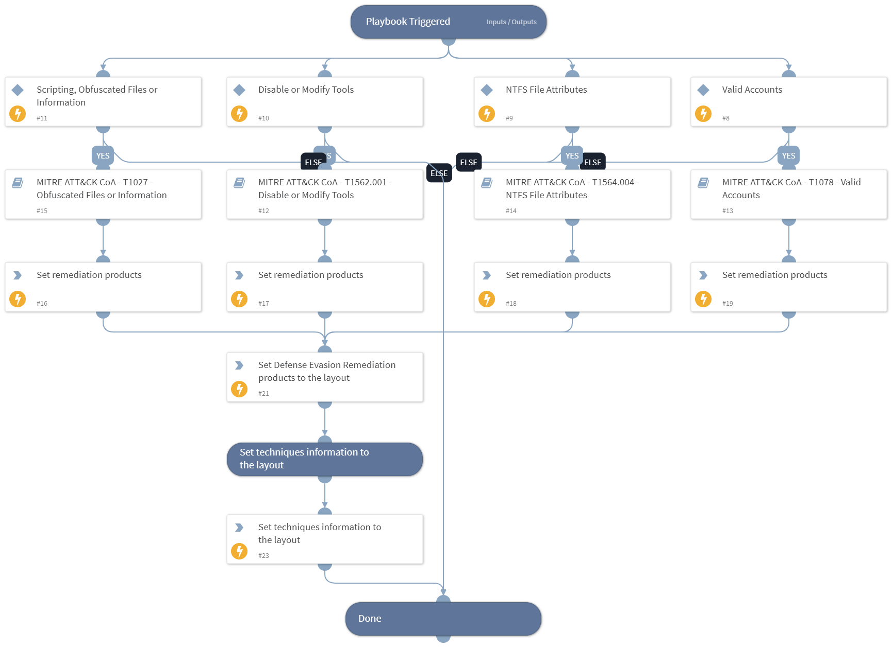

This playbook handles MITRE ATT&CK Techniques using intelligence-driven Courses of Action (COA) defined by Palo Alto Networks Unit 42 team. It utilizes each of the sub-playbooks for specific techniques that belong to this phase (tactic) according to the MITRE ATT&CK kill chain. The sub-playbook called depends on the technique input.
 
***Disclaimer: This playbook does not simulate an attack using the specified techniques, but follows the steps to remediation as defined by Palo Alto Networks Unit 42 team’s Actionable Threat Objects and Mitigations (ATOMs).
 
Tactic:
- TA0005: Defense Evasion

MITRE ATT&CK Description: 
The adversary is trying to avoid being detected.

Defense Evasion consists of techniques that adversaries use to avoid detection throughout their compromise. Techniques used for defense evasion include uninstalling/disabling security software or obfuscating/encrypting data and scripts. Adversaries also leverage and abuse trusted processes to hide and masquerade their malware. Other tactics’ techniques are cross-listed here when those techniques include the added benefit of subverting defenses.

Possible playbook triggers:
- The playbook can be used as a part of the “Courses of Action - Collection” playbook to remediate techniques based on kill chain phase.
- The playbook can be used as a part of the “MITRE ATT&CK - Courses of Action” playbook, that can be triggered by different sources and accepts the technique MITRE ATT&CK ID as an input.

## Dependencies
This playbook uses the following sub-playbooks, integrations, and scripts.

### Sub-playbooks
* MITRE ATT&CK CoA - T1562.001 - Disable or Modify Tools
* MITRE ATT&CK CoA - T1564.004 - NTFS File Attributes
* MITRE ATT&CK CoA - T1078 - Valid Accounts
* MITRE ATT&CK CoA - T1027 - Obfuscated Files or Information

### Integrations
This playbook does not use any integrations.

### Scripts
* Set
* SetAndHandleEmpty

### Commands
* setIncident

## Playbook Inputs
---

| **Name** | **Description** | **Default Value** | **Required** |
| --- | --- | --- | --- |
| technique | Mitre ATT&amp;amp;CK ID of a technique. |  | Optional |
| template | Template name to enforce WildFire best practices profile. |  | Optional |
| pre_post | Rules location. Can be 'pre-rulebase' or 'post-rulebase'. Mandatory for Panorama instances. |  | Optional |
| device-group | The device group for which to return addresses \(Panorama instances\). |  | Optional |
| tag | Tag for which to filter the rules. |  | Optional |

## Playbook Outputs
---

| **Path** | **Description** | **Type** |
| --- | --- | --- |
| Handled.Techniques | The techniques handled in this playbook | unknown |
| DefenseEvasion.ProductList | Products used for remediation. | unknown |

## Playbook Image
---
