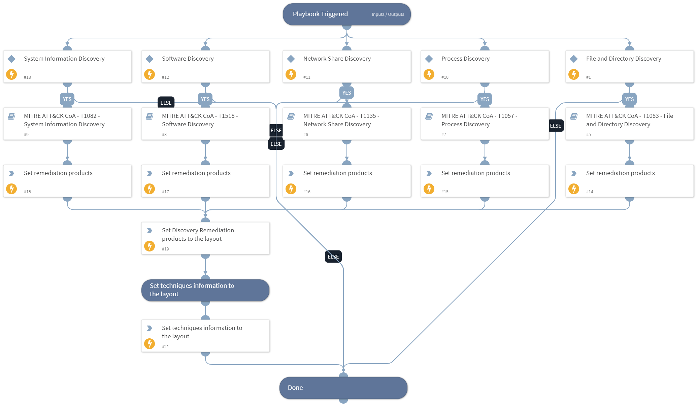

This playbook handles MITRE ATT&CK Techniques using intelligence-driven Courses of Action (COA) defined by Palo Alto Networks Unit 42 team. It utilizes each of the sub-playbooks for specific techniques that belong to this phase (tactic) according to the MITRE ATT&CK kill chain. The sub-playbook called depends on the technique input.
 
***Disclaimer: This playbook does not simulate an attack using the specified techniques, but follows the steps to remediation as defined by Palo Alto Networks Unit 42 team’s Actionable Threat Objects and Mitigations (ATOMs).
 
Tactic:
- TA0007: Discovery

MITRE ATT&CK Description: 
The adversary is trying to figure out your environment.

Discovery consists of techniques an adversary may use to gain knowledge about the system and internal network. These techniques help adversaries observe the environment and orient themselves before deciding how to act. They also allow adversaries to explore what they can control and what’s around their entry point in order to discover how it could benefit their current objective. Native operating system tools are often used toward this post-compromise information-gathering objective.

Possible playbook triggers:
- The playbook can be used as a part of the “Courses of Action - Collection” playbook to remediate techniques based on kill chain phase.
- The playbook can be used as a part of the “MITRE ATT&CK - Courses of Action” playbook, that can be triggered by different sources and accepts the technique MITRE ATT&CK ID as an input.

## Dependencies

This playbook uses the following sub-playbooks, integrations, and scripts.

### Sub-playbooks

* MITRE ATT&CK CoA - T1518 - Software Discovery
* MITRE ATT&CK CoA - T1135 - Network Share Discovery
* MITRE ATT&CK CoA - T1082 - System Information Discovery
* MITRE ATT&CK CoA - T1083 - File and Directory Discovery
* MITRE ATT&CK CoA - T1057 - Process Discovery

### Integrations

This playbook does not use any integrations.

### Scripts

* SetAndHandleEmpty
* Set

### Commands

* setIncident

## Playbook Inputs

---

| **Name** | **Description** | **Default Value** | **Required** |
| --- | --- | --- | --- |
| technique | Mitre ATT&amp;CK ID of a technique. |  | Optional |

## Playbook Outputs

---

| **Path** | **Description** | **Type** |
| --- | --- | --- |
| Handled.Techniques | The techniques handled in this playbook | unknown |
| Discovery.ProductList | Products used for remediation. | unknown |

## Playbook Image

---

