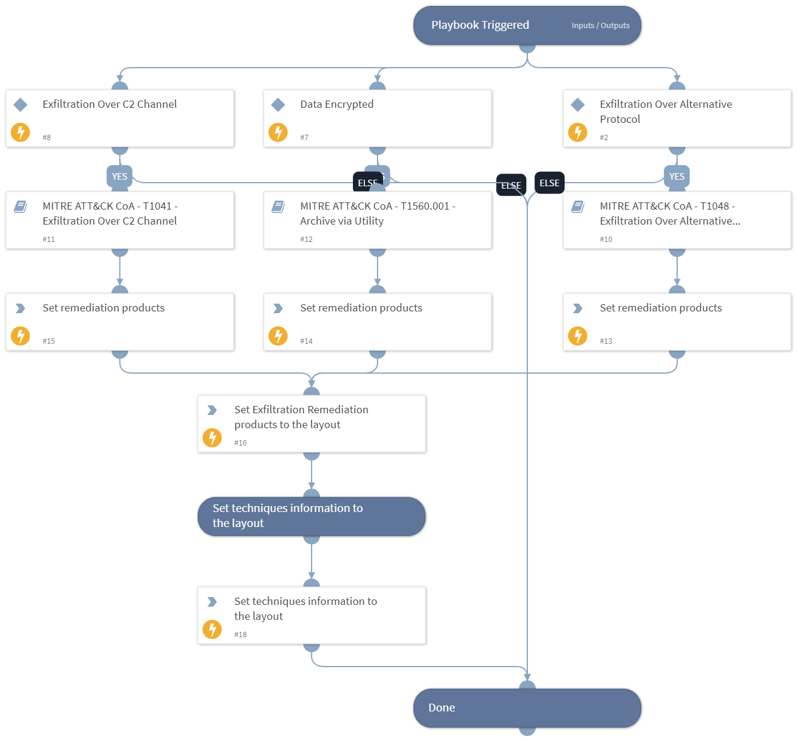

This playbook handles MITRE ATT&CK Techniques using intelligence-driven Courses of Action (COA) defined by Palo Alto Networks Unit 42 team. It utilizes each of the sub-playbooks for specific techniques that belong to this phase (tactic) according to the MITRE ATT&CK kill chain. The sub-playbook called depends on the technique input.
 
***Disclaimer: This playbook does not simulate an attack using the specified techniques, but follows the steps to remediation as defined by Palo Alto Networks Unit 42 team’s Actionable Threat Objects and Mitigations (ATOMs).
 
Tactic:
- TA0010: Exfiltration

MITRE ATT&CK Description: 
The adversary is trying to steal data.

Exfiltration consists of techniques that adversaries may use to steal data from your network. Once they’ve collected data, adversaries often package it to avoid detection while removing it. This can include compression and encryption. Techniques for getting data out of a target network typically include transferring it over their command and control channel or an alternate channel and may also include putting size limits on the transmission.

Possible playbook triggers:
- The playbook can be used as a part of the “Courses of Action - Collection” playbook to remediate techniques based on kill chain phase.
- The playbook can be used as a part of the “MITRE ATT&CK - Courses of Action” playbook, that can be triggered by different sources and accepts the technique MITRE ATT&CK ID as an input.

## Dependencies
This playbook uses the following sub-playbooks, integrations, and scripts.

### Sub-playbooks
* MITRE ATT&CK CoA - T1041 - Exfiltration Over C2 Channel
* MITRE ATT&CK CoA - T1048 - Exfiltration Over Alternative Protocol
* MITRE ATT&CK CoA - T1560.001 - Archive via Utility

### Integrations
This playbook does not use any integrations.

### Scripts
* Set
* SetAndHandleEmpty

### Commands
* setIncident

## Playbook Inputs
---

| **Name** | **Description** | **Default Value** | **Required** |
| --- | --- | --- | --- |
| technique | Mitre ATT&amp;amp;CK ID of a technique. |  | Optional |
| pre_post | Rules location. Can be 'pre-rulebase' or 'post-rulebase'. Mandatory for Panorama instances. |  | Optional |
| device-group | The device group for which to return addresses \(Panorama instances\). |  | Optional |
| tag | Tag for which to filter the rules. |  | Optional |

## Playbook Outputs
---

| **Path** | **Description** | **Type** |
| --- | --- | --- |
| Handled.Techniques | The techniques handled in this playbook | unknown |
| Exfiltration.ProductList | Products used for remediation. | unknown |

## Playbook Image
---
