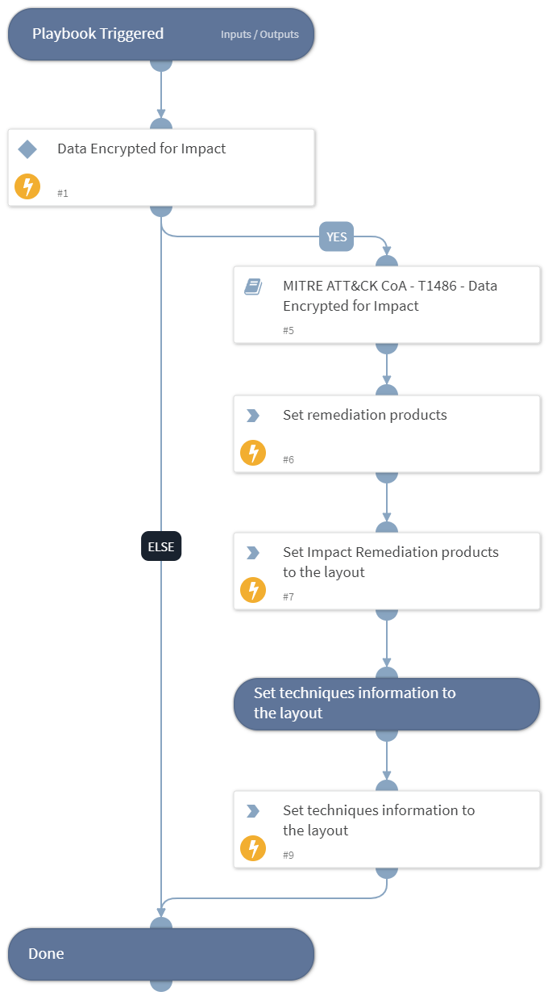

This playbook handles MITRE ATT&CK Techniques using intelligence-driven Courses of Action (COA) defined by Palo Alto Networks Unit 42 team. It utilizes each of the sub-playbooks for specific techniques that belong to this phase (tactic) according to the MITRE ATT&CK kill chain. The sub-playbook called depends on the technique input.
 
***Disclaimer: This playbook does not simulate an attack using the specified techniques, but follows the steps to remediation as defined by Palo Alto Networks Unit 42 team’s Actionable Threat Objects and Mitigations (ATOMs).
 
Tactic:
- TA0040: Impact

MITRE ATT&CK Description: 
The adversary is trying to manipulate, interrupt, or destroy your systems and data.

Impact consists of techniques that adversaries use to disrupt availability or compromise integrity by manipulating business and operational processes. Techniques used for impact can include destroying or tampering with data. In some cases, business processes can look fine, but may have been altered to benefit the adversaries’ goals. These techniques might be used by adversaries to follow through on their end goal or to provide cover for a confidentiality breach.

Possible playbook triggers:
- The playbook can be used as a part of the “Courses of Action - Collection” playbook to remediate techniques based on kill chain phase.
- The playbook can be used as a part of the “MITRE ATT&CK - Courses of Action” playbook, that can be triggered by different sources and accepts the technique MITRE ATT&CK ID as an input.

## Dependencies
This playbook uses the following sub-playbooks, integrations, and scripts.

### Sub-playbooks
* MITRE ATT&CK CoA - T1486 - Data Encrypted for Impact

### Integrations
This playbook does not use any integrations.

### Scripts
* Set
* SetAndHandleEmpty

### Commands
* setIncident

## Playbook Inputs

---

| **Name** | **Description** | **Default Value** | **Required** |
| --- | --- | --- | --- |
| technique | Mitre ATT&amp;amp;CK ID of a technique. |  | Optional |

## Playbook Outputs

---

| **Path** | **Description** | **Type** |
| --- | --- | --- |
| Handled.Techniques | The technique handled in this playbook | unknown |
| Impact.ProductList | Products used for remediation. | unknown |

## Playbook Image

---
