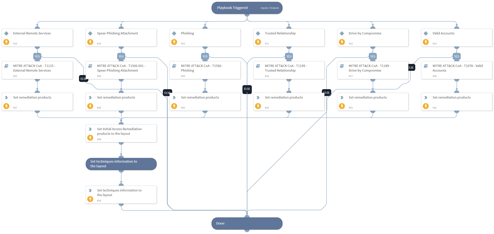

This playbook handles MITRE ATT&CK Techniques using intelligence-driven Courses of Action (COA) defined by Palo Alto Networks Unit 42 team. It utilizes each of the sub-playbooks for specific techniques that belong to this phase (tactic) according to the MITRE ATT&CK kill chain. The sub-playbook called depends on the technique input.
 
***Disclaimer: This playbook does not simulate an attack using the specified techniques, but follows the steps to remediation as defined by Palo Alto Networks Unit 42 team’s Actionable Threat Objects and Mitigations (ATOMs).
 
Tactic:
- TA0001: Initial Access

MITRE ATT&CK Description: 
The adversary is trying to get into your network.

Initial Access consists of techniques that use various entry vectors to gain their initial foothold within a network. Techniques used to gain a foothold include targeted spearphishing and exploiting weaknesses on public-facing web servers. Footholds gained through initial access may allow for continued access, like valid accounts and use of external remote services, or may be limited-use due to changing passwords.

Possible playbook triggers:
- The playbook can be used as a part of the “Courses of Action - Collection” playbook to remediate techniques based on kill chain phase.
- The playbook can be used as a part of the “MITRE ATT&CK - Courses of Action” playbook, that can be triggered by different sources and accepts the technique MITRE ATT&CK ID as an input.

## Dependencies
This playbook uses the following sub-playbooks, integrations, and scripts.

### Sub-playbooks
* MITRE ATT&CK CoA - T1078 - Valid Accounts
* MITRE ATT&CK CoA - T1189 - Drive-by Compromise
* MITRE ATT&CK CoA - T1199 - Trusted Relationship
* MITRE ATT&CK CoA - T1133 - External Remote Services
* MITRE ATT&CK CoA - T1566 - Phishing
* MITRE ATT&CK CoA - T1566.001 - Spear-Phishing Attachment

### Integrations
This playbook does not use any integrations.

### Scripts
* Set
* SetAndHandleEmpty

### Commands
* setIncident

## Playbook Inputs
---

| **Name** | **Description** | **Default Value** | **Required** |
| --- | --- | --- | --- |
| technique | Mitre ATT&amp;amp;CK ID of a technique |  | Optional |
| template | Template name to enforce WildFire best practices profile. |  | Optional |
| pre_post | Rules location. Can be 'pre-rulebase' or 'post-rulebase'. Mandatory for Panorama instances. |  | Optional |
| device-group | The device group for which to return addresses \(Panorama instances\). |  | Optional |
| tag | Tag for which to filter the rules. |  | Optional |

## Playbook Outputs
---

| **Path** | **Description** | **Type** |
| --- | --- | --- |
| Handled.Techniques | The techniques handled in this playbook | string |
| InitialAccess.ProductList | Products used for remediation. | unknown |

## Playbook Image
---
