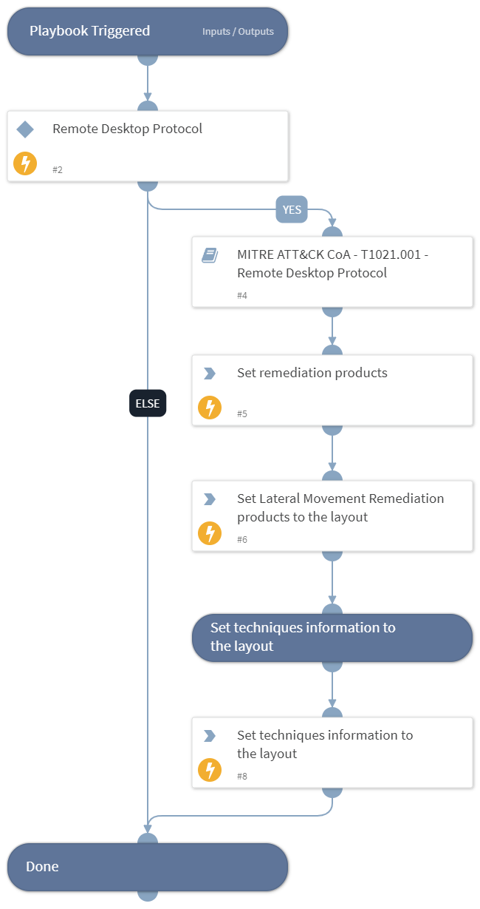

This playbook handles MITRE ATT&CK Techniques using intelligence-driven Courses of Action (COA) defined by Palo Alto Networks Unit 42 team. It utilizes each of the sub-playbooks for specific techniques that belong to this phase (tactic) according to the MITRE ATT&CK kill chain. The sub-playbook called depends on the technique input.
 
***Disclaimer: This playbook does not simulate an attack using the specified techniques, but follows the steps to remediation as defined by Palo Alto Networks Unit 42 team’s Actionable Threat Objects and Mitigations (ATOMs).
 
Tactic:
- TA0008: Lateral Movement

MITRE ATT&CK Description: 
The adversary is trying to move through your environment.

Lateral Movement consists of techniques that adversaries use to enter and control remote systems on a network. Following through on their primary objective often requires exploring the network to find their target and subsequently gaining access to it. Reaching their objective often involves pivoting through multiple systems and accounts to gain. Adversaries might install their own remote access tools to accomplish Lateral Movement or use legitimate credentials with native network and operating system tools, which may be stealthier.

Possible playbook triggers:
- The playbook can be used as a part of the “Courses of Action - Collection” playbook to remediate techniques based on kill chain phase.
- The playbook can be used as a part of the “MITRE ATT&CK - Courses of Action” playbook, that can be triggered by different sources and accepts the technique MITRE ATT&CK ID as an input.

## Dependencies
This playbook uses the following sub-playbooks, integrations, and scripts.

### Sub-playbooks
* MITRE ATT&CK CoA - T1021.001 - Remote Desktop Protocol

### Integrations
This playbook does not use any integrations.

### Scripts
* Set
* SetAndHandleEmpty

### Commands
* setIncident

## Playbook Inputs
---

| **Name** | **Description** | **Default Value** | **Required** |
| --- | --- | --- | --- |
| technique | Mitre ATT&amp;amp;CK ID of a technique. |  | Optional |

## Playbook Outputs
---

| **Path** | **Description** | **Type** |
| --- | --- | --- |
| Handled.Techniques | The technique handled in this playbook | string |
| LateralMovement.ProductList | Products used for remediation. | unknown |

## Playbook Image
---
