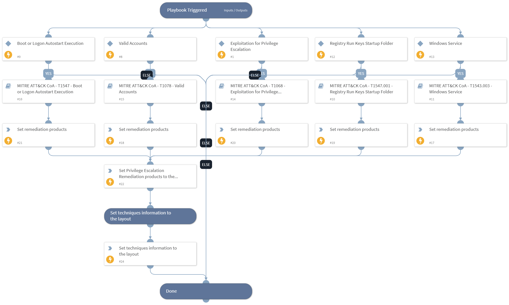

This playbook handles MITRE ATT&CK Techniques using intelligence-driven Courses of Action (COA) defined by Palo Alto Networks Unit 42 team. It utilizes each of the sub-playbooks for specific techniques that belong to this phase (tactic) according to the MITRE ATT&CK kill chain. The sub-playbook called depends on the technique input.
 
***Disclaimer: This playbook does not simulate an attack using the specified techniques, but follows the steps to remediation as defined by Palo Alto Networks Unit 42 team’s Actionable Threat Objects and Mitigations (ATOMs).
 
Tactic:
- TA0004: Privilege Escalation

MITRE ATT&CK Description: 
The adversary is trying to gain higher-level permissions.

Privilege Escalation consists of techniques that adversaries use to gain higher-level permissions on a system or network. Adversaries can often enter and explore a network with unprivileged access but require elevated permissions to follow through on their objectives. Common approaches are to take advantage of system weaknesses, misconfigurations, and vulnerabilities. Examples of elevated access include: • SYSTEM/root level• local administrator• user account with admin-like access • user accounts with access to specific system or perform specific functionThese techniques often overlap with Persistence techniques, as OS features that let an adversary persist can execute in an elevated context.

Possible playbook triggers:
- The playbook can be used as a part of the “Courses of Action - Collection” playbook to remediate techniques based on kill chain phase.
- The playbook can be used as a part of the “MITRE ATT&CK - Courses of Action” playbook, that can be triggered by different sources and accepts the technique MITRE ATT&CK ID as an input.

## Dependencies
This playbook uses the following sub-playbooks, integrations, and scripts.

### Sub-playbooks
* MITRE ATT&CK CoA - T1068 - Exploitation for Privilege Escalation
* MITRE ATT&CK CoA - T1547.001 - Registry Run Keys Startup Folder
* MITRE ATT&CK CoA - T1543.003 - Windows Service
* MITRE ATT&CK CoA - T1547 - Boot or Logon Autostart Execution
* MITRE ATT&CK CoA - T1078 - Valid Accounts

### Integrations
This playbook does not use any integrations.

### Scripts
* Set
* SetAndHandleEmpty

### Commands
* setIncident

## Playbook Inputs
---

| **Name** | **Description** | **Default Value** | **Required** |
| --- | --- | --- | --- |
| technique | Mitre ATT&amp;amp;CK ID of a technique. |  | Optional |
| pre_post | Rules location. Can be 'pre-rulebase' or 'post-rulebase'. Mandatory for Panorama instances. |  | Optional |
| device-group | The device group for which to return addresses \(Panorama instances\). |  | Optional |
| tag | Tag for which to filter the rules. |  | Optional |

## Playbook Outputs
---

| **Path** | **Description** | **Type** |
| --- | --- | --- |
| Handled.Techniques | The technique handled in this playbook | unknown |
| PrivilegeEscalation.ProductList | Products used for remediation. | unknown |

## Playbook Image
---
