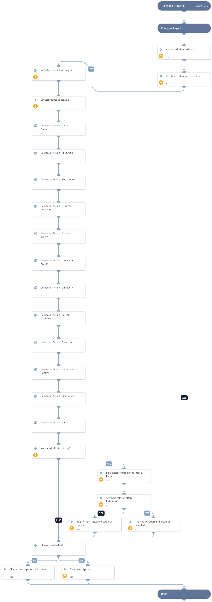

This is the parent playbook, which contains all phases and remediates MITRE ATT&CK techniques using intelligence-driven Courses of Action (COA) defined by Palo Alto Networks Unit 42 team. The playbook utilizes several other MITRE ATT&CK remediation playbooks.
 
The playbook follows the MITRE ATT&CK kill chain phases and takes action to protect the organization from the inputted techniques, displaying and implementing security policy recommendations for Palo Alto Networks products.
 
***Disclaimer: This playbook does not simulate an attack using the specified techniques, but follows the steps to remediation as defined by Palo Alto Networks Unit 42 team’s Actionable Threat Objects and Mitigations (ATOMs).
Possible playbook triggers:
- The playbook can be triggered by a feed integration fetching indicators that contain MITRE ATT&CK techniques as “Feed Related Indicators”, using the "MITRE ATT&CK - Courses of Action - Job" playbook.
- The playbook can be triggered manually for specific MITRE ATT&CK techniques using the ‘techniqueByIncident’ playbook input.
- An incident that contains MITRE ATT&CK technique IDs using the ‘techniqueByIncident’ playbook input.

## Dependencies
This playbook uses the following sub-playbooks, integrations, and scripts.

### Sub-playbooks
* Courses of Action - Command and Control
* Courses of Action - Initial Access
* Courses of Action - Credential Access
* Courses of Action - Defense Evasion
* Courses of Action - Execution
* Courses of Action - Exfiltration
* Courses of Action - Persistence
* Courses of Action - Lateral Movement
* Courses of Action - Collection
* Courses of Action - Privilege Escalation
* Courses of Action - Discovery
* Courses of Action - Impact

### Integrations
This playbook does not use any integrations.

### Scripts
* Set

### Commands
* findIndicators
* setIncident
* appendIndicatorField
* closeInvestigation

## Playbook Inputs
---

| **Name** | **Description** | **Default Value** | **Required** |
| --- | --- | --- | --- |
| TechniquesList | MITRE ATT&amp;amp;CK ID of a technique, or comma-separated list of techniques IDs. | incident.techniqueslist | Optional |
| template | Template name to enforce WildFire best practices profile. |  | Optional |
| pre_post | Rules location. Can be 'pre-rulebase' or 'post-rulebase'. Mandatory for Panorama instances. |  | Optional |
| device-group | The device group for which to return addresses \(Panorama instances\). |  | Optional |
| tag | Tag for which to filter the rules. |  | Optional |

## Playbook Outputs
---

| **Path** | **Description** | **Type** |
| --- | --- | --- |
| Handled.Techniques | The techniques handled in this playbook | unknown |

## Playbook Image
---
