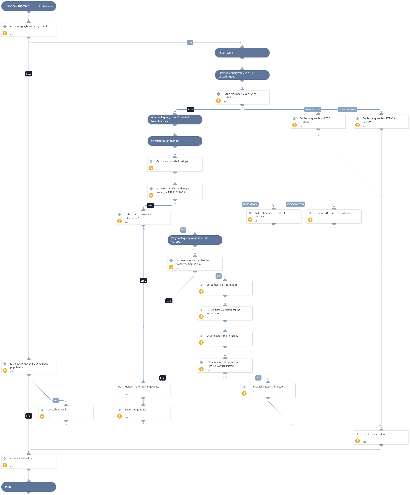

This is a wrapper playbook for the "MITRE ATT&CK - Courses of Action" use-case.

Possible playbook triggers:
- Through a job, by a feed integration fetching indicators that contain MITRE ATT&CK techniques as “Feed Related Indicators”, or with custom inputs.
- Through an incident, using custom playbook inputs.

Once triggered, the playbook will create a new incident from type "MITRE ATT&CK CoA". The incident will trigger the playbook "MITRE ATT&CK - Courses of Action", 
which contains all phases and remediates MITRE ATT&CK techniques using intelligence-driven Courses of Action (COA) defined by Palo Alto Networks Unit 42 team. 
 
***Disclaimer: This playbook does not simulate an attack using the specified techniques, but follows the steps to remediation as defined by Palo Alto Networks Unit 42 team’s Actionable Threat Objects and Mitigations (ATOMs).

## Dependencies
This playbook uses the following sub-playbooks, integrations, and scripts.

### Sub-playbooks
This playbook does not use any sub-playbooks.

### Integrations
This playbook does not use any integrations.

### Scripts
* SearchIndicatorRelationships
* Set
* DeleteContext

### Commands
* closeInvestigation
* findIndicators
* createNewIncident

## Playbook Inputs
---

| **Name** | **Description** | **Default Value** | **Required** |
| --- | --- | --- | --- |
| techniqueByIncident | MITRE ATT&amp;amp;CK ID of a technique, or comma-separated list of techniques IDs. |  | Optional |
| Indicator Query | Define a query that will retrieve indicators that contain MITRE ATT&amp;amp;CK techniques under the "Feed Related Indicators" field. \(Possible query example: \`feedrelatedindicators.type:"MITRE ATT&amp;amp;CK"\`\) | type:"Attack Pattern" or type:Report and feedrelatedindicators.type:"MITRE ATT&amp;CK" | Optional |
| template | Template name to enforce WildFire best practices profile. |  | Optional |
| pre_post | Rules location. Can be 'pre-rulebase' or 'post-rulebase'. Mandatory for Panorama instances. |  | Optional |
| device-group | The device group for which to return addresses \(Panorama instances\). |  | Optional |
| tag | Tag for which to filter the rules. |  | Optional |
| query_type | The type of the indicator query this playbook is running. Possible values can be: Direct - The playbook query returns a list of "STIX ATT&amp;amp;CK Pattern" indicators. ,relationship,unit42,other |  | Optional |

## Playbook Outputs
---

| **Path** | **Description** | **Type** |
| --- | --- | --- |
| Handled.Techniques | The techniques handled in this playbook | unknown |

## Playbook Image
---
