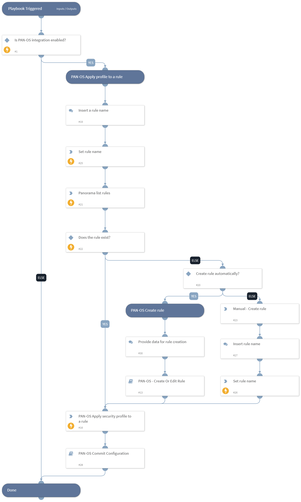

This playbook is used to apply a PAN-OS security profile to a policy rule.
The playbook performs the following tasks:
- Accepts a rule name to apply the security profile to.
- Applies the security profile to the rule if the rule exists. If not, creates the rule and applies.
- Commits the configuration.

## Dependencies
This playbook uses the following sub-playbooks, integrations, and scripts.

### Sub-playbooks
* PAN-OS Commit Configuration
* PAN-OS - Create Or Edit Rule

### Integrations
This playbook does not use any integrations.

### Scripts
* Set

### Commands
* pan-os-apply-security-profile
* pan-os-list-rules

## Playbook Inputs
---

| **Name** | **Description** | **Default Value** | **Required** |
| --- | --- | --- | --- |
| device-group | The device group to work on. Exists only in panorama\! |  | Optional |
| profile_type | Security profile type. Can be 'data-filtering', 'file-blocking', 'spyware', 'url-filtering', 'virus, 'vulnerability', or wildfire-analysis.' |  | Required |
| profile_name | The profile name to apply to the rule. |  | Required |
| pre-post-rulebase | Determines whether the rule is a pre-rulebase or post-rulebase rule, according to the rule structure. Exists only in panorama\! |  | Optional |
| tag | Tag for which to filter the rules. |  | Optional |

## Playbook Outputs
---
There are no outputs for this playbook.

## Playbook Image
---
