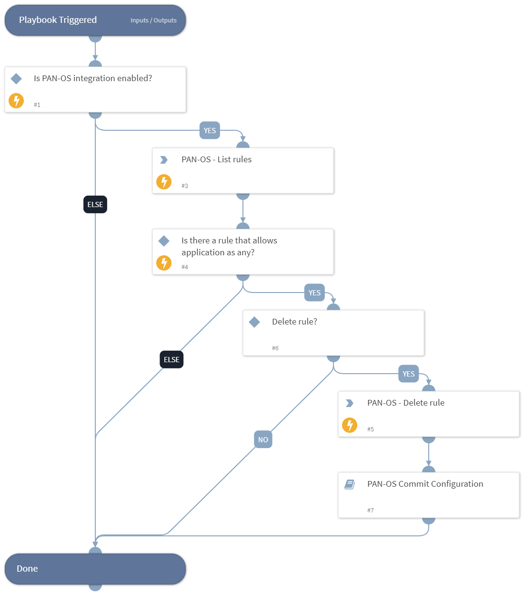

This playbook is used to find and remove all rules that allow unauthorized applications communication as any.
The playbook performs the following tasks:
- Lists PAN-OS policy rules.
- Checks for a rule that allows applications as any.
- Deletes the rule based on user approval.
- Commits the configuration.

## Dependencies
This playbook uses the following sub-playbooks, integrations, and scripts.

### Sub-playbooks
* PAN-OS Commit Configuration

### Integrations
This playbook does not use any integrations.

### Scripts
This playbook does not use any scripts.

### Commands
* pan-os-list-rules
* pan-os-delete-rule

## Playbook Inputs
---

| **Name** | **Description** | **Default Value** | **Required** |
| --- | --- | --- | --- |
| pre_post | Rules location. Can be 'pre-rulebase' or 'post-rulebase'. Mandatory for Panorama instances. |  | Optional |
| device-group | The device group for which to return addresses \(Panorama instances\). |  | Optional |
| tag | Tag for which to filter the rules. |  | Optional |

## Playbook Outputs
---
There are no outputs for this playbook.

## Playbook Image
---
