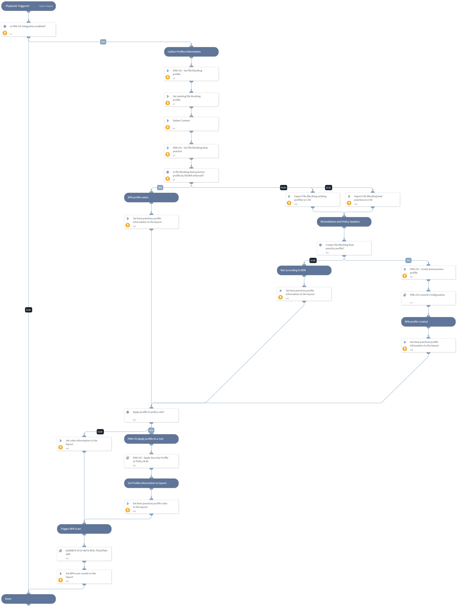

This playbook enforces the File Blocking Best Practices Profile as defined by Palo Alto Networks BPA.
The playbook performs the following tasks:
- Get the existing profile information.
- Get the best practices profile information.
- Check if the best practices profile set by Cortex XSOAR is enforced. (If not, the playbook allows the user to compare the existing profile with the best practices and decide on the action to take).
- Create best practices profile.
- Apply profile to policy rules on PAN-OS firewall or Panorama.

## Dependencies
This playbook uses the following sub-playbooks, integrations, and scripts.

### Sub-playbooks
* Palo Alto Networks BPA - Submit Scan
* PAN-OS Commit Configuration
* PAN-OS - Apply Security Profile to Policy Rule

### Integrations
This playbook does not use any integrations.

### Scripts
* ExportToCSV
* IsIntegrationAvailable
* SetAndHandleEmpty
* DeleteContext

### Commands
* setIncident
* pan-os-create-file-blocking-best-practice-profile
* pan-os-get-security-profiles
* pan-os-get-file-blocking-best-practice

## Playbook Inputs
---

| **Name** | **Description** | **Default Value** | **Required** |
| --- | --- | --- | --- |
| device-group | The device group to work on. Exists only in panorama\! |  | Optional |
| tag | Tag for which to filter the results. |  | Optional |
| pre-post-rulebase | Determines whether the rule is a pre-rulebase or post-rulebase rule, according to the rule structure. Exists only in panorama\! |  | Optional |

## Playbook Outputs
---
There are no outputs for this playbook.

## Playbook Image
---
