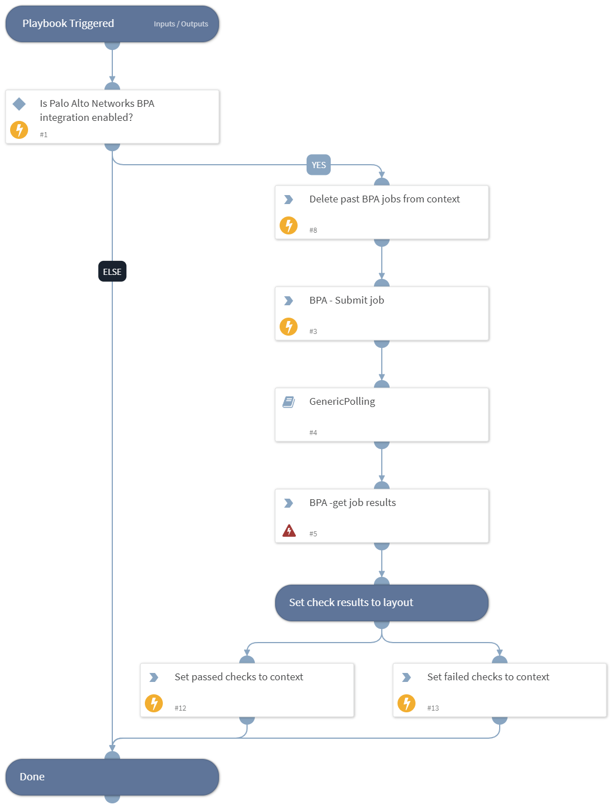

This playbook accepts a list of BPA checks, triggers a job and returns the checks results.

## Dependencies
This playbook uses the following sub-playbooks, integrations, and scripts.

### Sub-playbooks
* GenericPolling

### Integrations
* BPA

### Scripts
* SetAndHandleEmpty
* IsIntegrationAvailable
* DeleteContext

### Commands
* pan-os-bpa-get-job-results
* pan-os-bpa-submit-job

## Playbook Inputs
---

| **Name** | **Description** | **Default Value** | **Required** |
| --- | --- | --- | --- |
| check_id | A comma-separated list of the BPA IDs of the results to return. |  | Optional |
| check_name | A comma-separated list of the name of the results to return. |  | Optional |

## Playbook Outputs
---

| **Path** | **Description** | **Type** |
| --- | --- | --- |
| PAN-OS-BPA.JobResults.JobID | The submitted job ID. | string |
| PAN-OS-BPA.JobResults.Checks.check_id | The list of check IDs. | string |
| PAN-OS-BPA.JobResults.Checks.check_name | The list of check names. | string |
| PAN-OS-BPA.JobResults.Checks.check_message | The list of check messages. | string |
| PAN-OS-BPA.JobResults.Checks.check_passed | Indicates whether the check has passed. | boolean |
| BPA.Passed | BPA passed checks | unknown |
| BPA.Failed | BPA failed checks | unknown |

## Playbook Image
---
