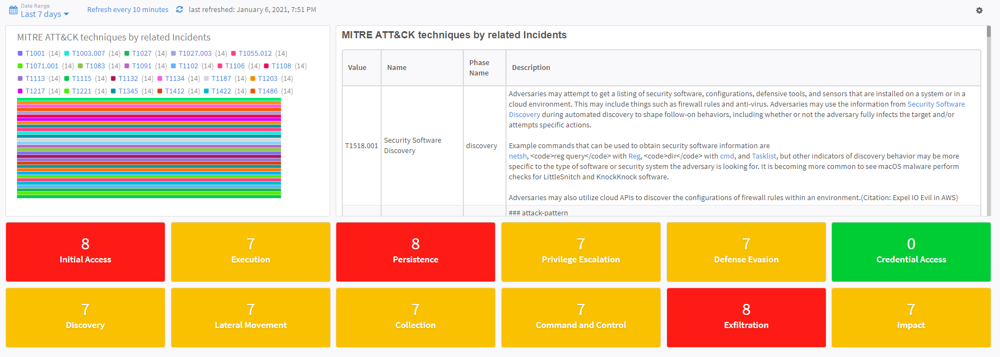
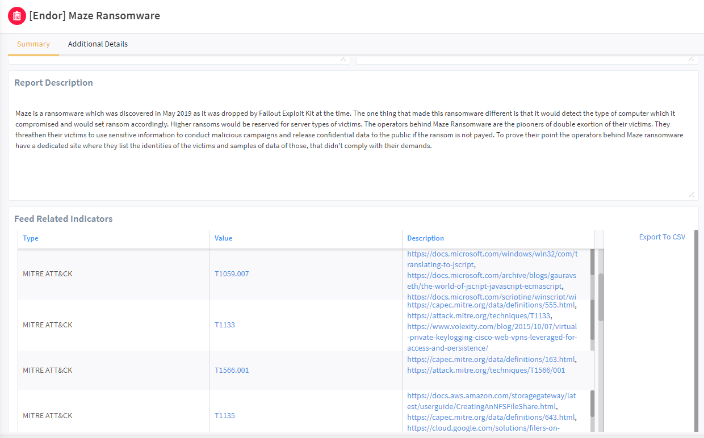
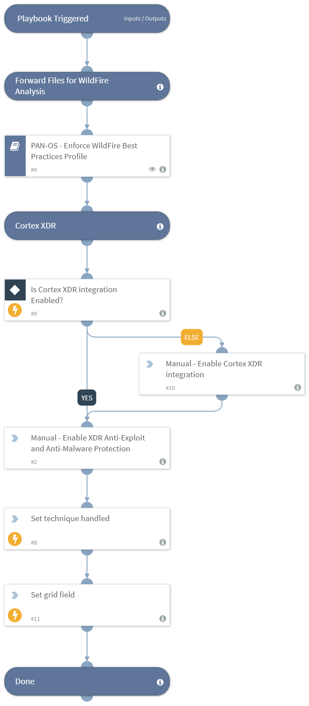

The process of ingesting quality threat intelligence, mapping the intelligence reports into MITRE ATT&CK tactics and techniques, and then translating this information into reliable and usable remediation steps can be tedious and very time consuming. This MITRE ATT&CK - Courses of Action Pack contains intelligence-driven Courses of Action (COA) defined by Palo Alto Networks Unit 42 team, that will enable you to handle MITRE ATT&CK techniques and sub-techniques in an organized and automated manner. This will make sure your organization is not only blocking specific reported IOCs but also taking a more holistic approach to prevent future attacks.

Using this content Pack, you can automate this whole process and have all of the information gathered in one place to help you keep your organization protected.
Each technique is mapped out-of-the-box into the specific Courses of Action that your organization needs in order to stay protected, using Palo Alto Networks products.

With this Pack, you can reduce the time your teams spend on consuming threat intelligence and translating the reports into action items, and on sustaining best practices policies for your security products. 

**What does this Pack do?**
- Automatically maps MITRE ATT&CK Techniques into Courses of Action playbooks.
- Takes action to remediate the techniques throughout Palo Alto Networks security products, following the MITRE ATT&CK kill chain.
- Checks existing profiles against best practices and suggests manual or automated policy changes. 
- The playbooks in the Pack can be triggered manually, by a job, by an incident, or by any threat intelligence feed.
- MITRE ATT&CK techniques are the playbook inputs and therefore playbooks can be triggered by any 3-rd party tools mapping to this framework.  
- When used with Unit 42 feed ingesting Actionable Threat Objects and Mitigations (ATOMs) - get notified as soon as there is a new threat actor report and take action immediately. 

For more information, please refer to the [MITRE ATT&CK - Courses of Action article](https://xsoar.pan.dev/docs/reference/packs/courses-of-action).  

**MITRE ATT&CK Dashboard**

**Unit 42 STIX Report Indicators**

**MITRE ATT&CK - Courses of Action Sample Playbook**

