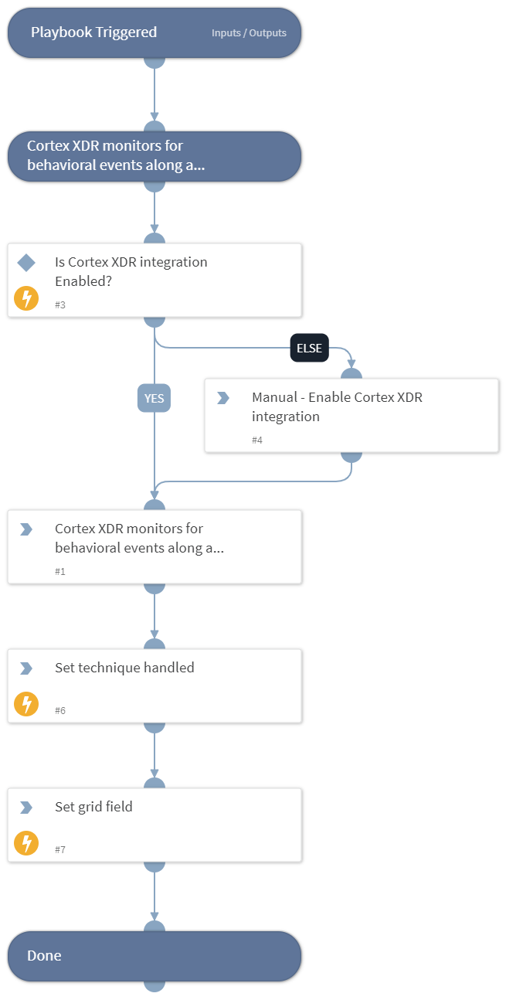

This playbook Remediates the Network Share Discovery technique using intelligence-driven Courses of Action (COA) defined by Palo Alto Networks Unit 42 team.
 
***Disclaimer: This playbook does not simulate an attack using the specified technique, but follows the steps to remediation as defined by Palo Alto Networks Unit 42 team’s Actionable Threat Objects and Mitigations (ATOMs).
Techniques Handled:
- T1135: Network Share Discovery

Kill Chain phases:
- Discovery

MITRE ATT&CK Description:

Adversaries may look for folders and drives shared on remote systems as a means of identifying sources of information to gather as a precursor for Collection and to identify potential systems of interest for Lateral Movement. Networks often contain shared network drives and folders that enable users to access file directories on various systems across a network.

File sharing over a Windows network occurs over the SMB protocol. [1] [2] Net can be used to query a remote system for available shared drives using the net view \remotesystem command. It can also be used to query shared drives on the local system using net share.

Possible playbook uses:
- The playbook can be used independently to handle and remediate the specific technique.
- The playbook can be used as a part of the “Courses of Action - Defense Evasion” playbook to remediate techniques based on the kill chain phase.
- The playbook can be used as a part of the “MITRE ATT&CK - Courses of Action” playbook, which can be triggered by different sources and accepts the technique MITRE ATT&CK ID as an input.

## Dependencies
This playbook uses the following sub-playbooks, integrations, and scripts.

### Sub-playbooks
This playbook does not use any sub-playbooks.

### Integrations
This playbook does not use any integrations.

### Scripts
* IsIntegrationAvailable
* Set
* SetGridField

### Commands
This playbook does not use any commands.

## Playbook Inputs
---
There are no inputs for this playbook.

## Playbook Outputs
---

| **Path** | **Description** | **Type** |
| --- | --- | --- |
| Handled.Techniques | The techniques handled in this playbook | unknown |

## Playbook Image
---
