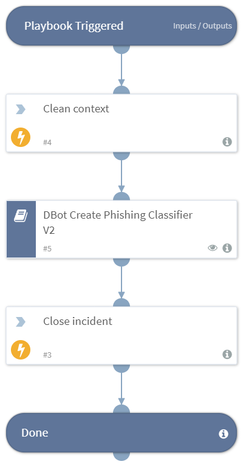

Trains the phishing machine learning model. This playbook should be used as job, to run repeatedly, for example every week. 

## Dependencies
This playbook uses the following sub-playbooks, integrations, and scripts.

## Sub-playbooks
* DBot Create Phishing Classifier V2

## Integrations
* Builtin

## Scripts
* DeleteContext

## Commands
* closeInvestigation

## Playbook Inputs
---
There are no inputs for this playbook.

## Playbook Outputs
---
There are no outputs for this playbook.

## Playbook Image
---

