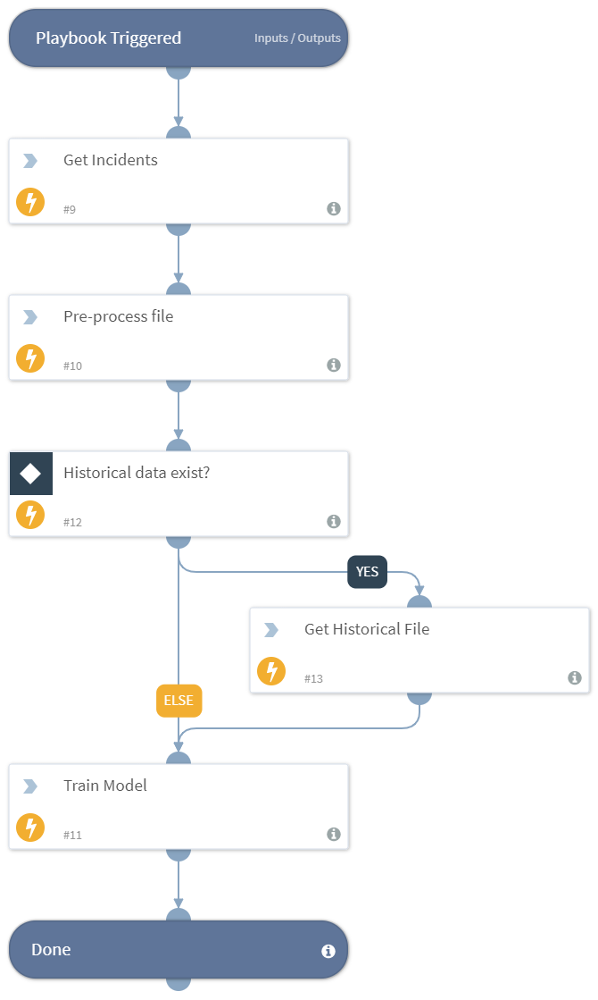

Creates a phishing classifier using machine learning technique, based on the email content.

## Dependencies
This playbook uses the following sub-playbooks, integrations, and scripts.

## Sub-playbooks
This playbook does not use any sub-playbooks.

## Integrations
This playbook does not use any integrations.

## Scripts
* GetIncidentsByQuery
* Base64ListToFile
* DBotPreProcessTextData
* DBotTrainTextClassifierV2

## Commands
This playbook does not use any commands.

## Playbook Inputs
---

| **Name** | **Description** | **Default Value** | **Source** | **Required** |
| --- | --- | --- | --- | --- |
| modelName | The model name to store in the system. | phishing_model | - | Optional |
| emailTextKey | The CSV list of incident fields names with the email body or html body. You can also use "|" if you want to choose the first non-empty value from a list of fields. | emailbody|emailbodyhtml|details | - | Optional |
| emailSubjectKey | The CSV list of incident fields names with the email subject. You can also use "|" if you want to choose the first non-empty value from a list of fields. | emailsubject|name | - | Optional |
| emailTagKey | The field name with the email tag. Supports a CSV list, the first non-empty value will be taken. | emailclassification | - | Optional |
| phishingLabels | The CSV list of email tags values and mapping. The script considers only the tags specified in this field. You can map label to another value by using this format: LABEL:MAPPED_LABEL. For example, for 4 values in email tag: malicious, credentials harvesting, inner communitcation, external legit email, unclassified. While training, we want to ignore "unclassified" tag, and refer to "credentials harvesting" as "malicious" too. Also, we want to merge "inner communitcation" and "external legit email" to one tag called "non-malicious". The input will be: malicious, credentials harvesting:malicious, inner communitcation:non-malicious, external legit email:non-malicious | * | - | Optional |
| incidentsQuery | The incidents query to fetch the training data for the model. | - | - | Optional |
| maxIncidentsToFetchOnTraining | The maximum number of incidents to fetch. | 3000 | - | Optional |
| hashSeed | If non-empty, hash every word with this seed. | - | - | Optional |
| historicalDataFileListName | The name of XSOAR list contains historical data training samples for the model. | - | - | Optional |
| overrideModel | Whether to override the existing model if a model with the same name exists. The default is "false". | true | - | Optional |
| incidentTypes | The CSV list of incident types by which to filter. | Phishing | - | Optional |
| dedupThreshold | Removes emails with similarity greater then this threshold. The range 0-1, where 1 is completly identical. | 0.99 | - | Optional |
| removeShortTextThreshold | The sample text of which the total number words are less than or equal to this number will be ignored. | 15 | - | Optional |
| modelTargetAccuracy | The model target accuracy, between 0 and 1. | 0.8 | - | Optional |
| outputFormat | The output file format. Can be "json" or "pickle". | pickle | - | Optional |

## Playbook Outputs
---

| **Path** | **Description** | **Type** |
| --- | --- | --- |
| DBotPhishingClassifier.EvaluationScores.Precision.All | The average binary precision over all classes (0-1). | number |
| DBotPhishingClassifier.EvaluationScores.TP.All | The number of instances of all classes that were predicted correctly. | number |
| DBotPhishingClassifier.EvaluationScores.Coverage.All | The number of instances that were predicted at a probability greater than the threshold. | number |
| DBotPhishingClassifier.EvaluationScores.Total.All | The total number of instances. | number |
| DBotPhishingClassifier.ModelName | The name of the model in XSOAR. | string |

## Playbook Image
---

