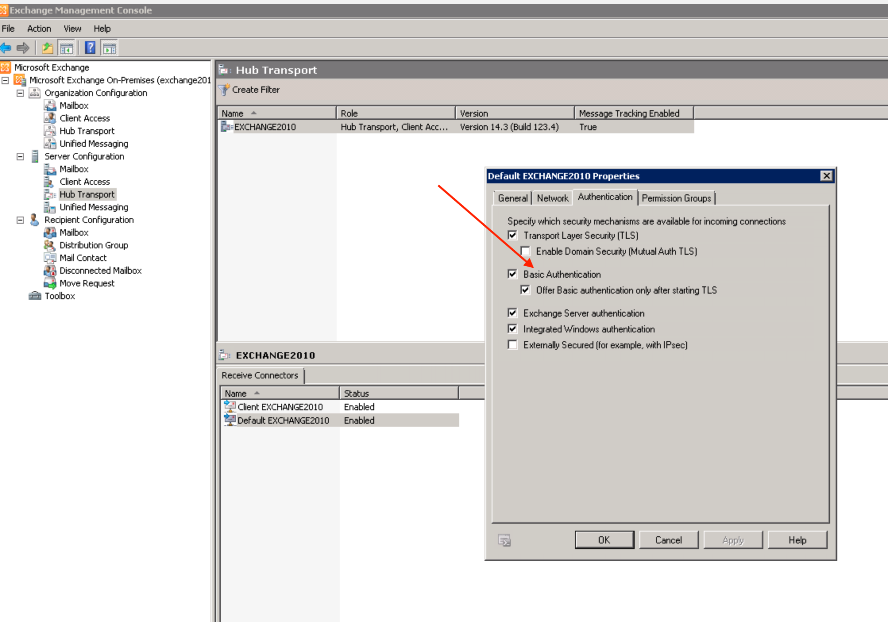

<!-- HTML_DOC -->

This is a Python script for sending emails, which includes various attachment implementations.

<h2>Supported Authentication</h2>

This integration does not support NTLM authentication. If you are using Exchange as the SMTP server for sending mail and receive the error message: <code>No suitable authentication method found.</code> make sure that you enable <strong>Basic Authentication</strong> for SMTP authentication in your Exchange environment.

 This example shows Basic Authentication on Exchange 2010:

<h2>Configure Mail Sender on Cortex XSOAR</h2>
<ol>
<li>Navigate to <strong>Settings</strong> &gt; <strong>Integrations</strong> &gt; <strong>Servers &amp; Services</strong>.</li>
<li>Search for Mail Sender (New).</li>
<li>Click <strong>Add instance</strong> to create and configure a new integration instance.
<ul>
<li>
<strong>Name:</strong> a textual name for the integration instance</li>
<li>
<strong>Mail server hostname</strong> or <strong>IP address</strong>
</li>
<li><strong>SMTP Port</strong></li>
<li><strong>Credentials</strong></li>
<li><strong>Password</strong></li>
<li>
<strong>Sender address</strong>: if the sender address is different than the log-in credentials and password, the sender address must have permission to send emails.</li>
<li>
<strong>FQDN</strong>: Fully Qualified Domain Name, used in EHLO</li>
<li><strong>Use TLS for connection</strong></li>
<li><strong>Do not validate server certificate (not secure)</strong></li>
</ul>
</li>
<li>Click <strong>Test</strong> to validate the URLs, token, and connection.</li>
</ol>
<h2>Commands</h2>
<ol>
<li><a href="#h_61535722051529934992493">Send email: send-mail</a></li>
</ol>
<h3 id="h_61535722051529934992493">1. Send email</h3>

Sends an email.

<h5>Basic Command</h5>

<code>send-mail</code>

<h5>Input</h5>
<table style="width: 750px;" border="2" cellpadding="6">
<thead>
<tr>
<td><strong>Argument Name</strong></td>
<td><strong>Description</strong></td>
</tr>
</thead>
<tbody>
<tr>
<td>to</td>
<td>Recipient email address</td>
</tr>
<tr>
<td>cc</td>
<td>Additional recipient email address</td>
</tr>
<tr>
<td>bcc</td>
<td>Additional recipient email address</td>
</tr>
<tr>
<td>subject</td>
<td>Subject of the email</td>
</tr>
<tr>
<td>body</td>
<td>Content of the email in plain text</td>
</tr>
<tr>
<td>htmlBody</td>
<td>Content of the email in html format</td>
</tr>
<tr>
<td>replyTo</td>
<td>

If recipient chooses to reply, reply will automatically be sent to this email address

</td>
</tr>
<tr>
<td>attachIDs </td>
<td>Comma-separated list of IDs of war room entries that contain the files you want to attach to the email</td>
</tr>
<tr>
<td>attachNames</td>
<td>

A comma-separated list of new names, to rename attachments, in correspondence with the order that they were attached to the email.

Examples:

<ul>
<li>To rename first and third file: attachNames=new_fileName1,,new_fileName3</li>
<li>To rename second and fifth files: attachNames=,new_fileName2,,,new_fileName5</li>
</ul>
</td>
</tr>
<tr>
<td>attachCIDs</td>
<td>

A comma-separated list of CIDs to embed attachments inside the email itself

</td>
</tr>
<tr>
<td>transientFile</td>
<td>

Textual name for attached file. Multiple files are supported.

</td>
</tr>
<tr>
<td>transientFileContent</td>
<td>

Content for attached file. Multiple files are supported.

Example:

transientFile.1="t1.txt" transientFileContent.1="test 1" transientFile.2="t3.txt" transientFileContent.2="test 3"

</td>
</tr>
<tr>
<td>transientFileCID</td>
<td>

CID for attached file if you want it inline. Multiple files are supported.

Example:

transientFile.1="t1.txt" transientFileContent.1="test 1" transientFileCID.1="t1.txt@xxx.yyy" transientFile.2="t3.txt" transientFileContent.2="test 3"

</td>
</tr>
<tr>
<td>templateParams</td>
<td>

Replace {varname} variables with values from this parameter.

Expected values are in the form of a JSON document

Example:

<pre>{  
   "varname":{  
      "value":"some value",
      "key":"context key"
   }
}
</pre>

Each var name can either be provided with a value or a context key to retrieve the value from. Note that only context data is accessible for this argument, while incident fields are not.

</td>
</tr>
<tr>
<td>additionalHeader</td>
<td>

Custom header to add to an email.

</td>
</tr>
</tbody>
</table>

 

<h5>Command Example</h5>
<pre>!send-mail to="name@example.com" cc="test@example.com" bcc="admin@example.com" subject="Topic of the day" replyTo="replymail@example.com" attachIDs="111@02a9cf84-c76f-4b2e-8840-c6b2a85c53cf,129@02a9cf84-c86f-4b2e-8840-c6c2a89c53cf" attachNames="notcookie.png,cookie.jpg" attachCIDs="notcookie,mycookie" transientFile="friendly_note.txt" transientFileContent="this is some text" htmlBody="&lt;html&gt;  &lt;body&gt; &lt;p&gt;HELLO&lt;/p&gt;  &lt;img src=\"cid:mycookie\"/&gt;  &lt;/body&gt; &lt;/html&gt;"</pre>

 

<h2>About CIDs</h2>

CIDs work by attaching the image to the email you are sending, and then using standard HTML image tags that reference that image to embed it in the email when the user opens it.

<h5> Example:</h5>
<pre>&lt;html&gt;
  &lt;body&gt;
    &lt;img src=\"cid:radomimagecid\"/&gt;
  &lt;/body&gt;
&lt;/html&gt;</pre>
<h3>CID Limitations</h3>

CID is not supported on all email applications. It is supported mainly on Outlook.

On web applications, such as Gmail, adding CID duplicates the attachment: as an actual attachment and embedded in the text body.

