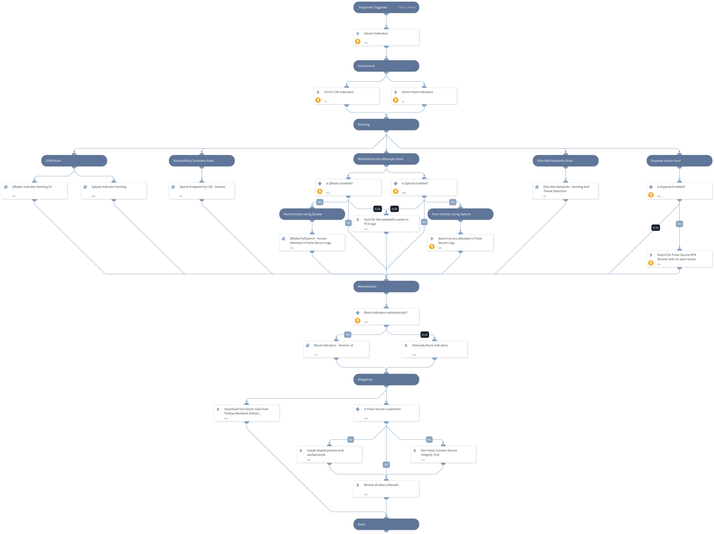

On April 20th, a new Remote Code Execution vulnerability in Pulse Connect Secure was disclosed. 
The reference number for the vulnerability is CVE-2021-22893 with the CVSS Score of 10.0. 
This playbook should be trigger manually and includes the following tasks: 

* Enrich related known CVEs and Malware Hashes used by the suspected APT actor.
* Search for unpatched endpoints vulnerable to the exploits.
* Search network facing system using Expanse for relevant issues.
* Indicators and known webshells hunting using SIEM products.
* Block indicators automatically or manually.
* Provide different mitigations that has been publicly published such as:
    * Patches
    * Workarounds
    * Yara and Snort Rules

Note: This is a beta playbook, which lets you implement and test pre-release software. Since the playbook is beta, it might contain bugs. Updates to the pack during the beta phase might include non-backward compatible features. We appreciate your feedback on the quality and usability of the pack to help us identify issues, fix them, and continually improve.

More information:
[Exploitation of Pulse Connect Secure Vulnerabilities](https://us-cert.cisa.gov/ncas/alerts/aa21-110a)

## Dependencies

This playbook uses the following sub-playbooks, integrations, and scripts.

### Sub-playbooks

* QRadar Indicator Hunting V2
* QRadarFullSearch
* Search Endpoint by CVE - Generic
* Palo Alto Networks - Hunting And Threat Detection
* Block Indicators - Generic v2
* Splunk Indicator Hunting

### Integrations

This playbook does not use any integrations.

### Scripts

This playbook does not use any scripts.

### Commands

* expanse-get-issues
* enrichIndicators
* splunk-search
* extractIndicators

## Playbook Inputs

---

| **Name** | **Description** | **Default Value** | **Required** |
| --- | --- | --- | --- |
| Related_Hashes | The known hashes of different malware families associated with the exploitation. | 06c56bd272b19bf7d7207443693cd1fc774408c4ca56744577b11fee550c23f7,64c87520565165ac95b74d6450b3ab8379544933dd3e2f2c4dc9b03a3ec570a7,1322340356018696d853e0ac6f7ce3a2,09956753b5000061524d204000000001,88170125598a4fb801102ad56494a773895059ac8550a983fdd2ef429653f079,9f6ac39707822d243445e30d27b8404466aa69c61119d5308785bf4a464a9ebd,325d6d60e24c7cfc3a782839d85ce08c8d3bb27c,1ab50b77dd9515f6cd9ed07d1d3176ba4627a292dc4a21b16ac9d211353818bd,1741dc0a491fcc8d078220ac9628152668d3370b92a8eae258e34ba28c6473b9,cd09ec795a8f4b6ced003500a44d810f49943514e2f92c81ab96c33e1c0fbd68,d72daafedf41d484f7f9816f7f076a9249a6808f1899649b7daa22c0447bb37b,c9b323b9747659eac25cec078895d75f016e26a8b5858567c7fb945b7321722c,2610d0372e0e107053bc001d278ef71f08562e5610691f18b978123c499a74d8,c774eca633136de35c9d2cd339a3b5d29f00f761657ea2aa438de4f33e4bbba4,224b7c45cf6fe4547d3ea66a12c30f3cb4c601b0a80744154697094e73dbd450,78d7c7c9f800f6824f63a99d935a4ad0112f97953d8c100deb29dae24d7da282,1d3ab04e21cfd40aa8d4300a359a09e3b520d39b1496be1e4bc91ae1f6730ecc,133631957d41eed9496ac2774793283ce26f8772de226e7f520d26667b51481a,68743e17f393d1f85ee937dffacc91e081b5f6f43477111ac96aa9d44826e4d2,7fa71a7f76ef63465cfeacf58217e0b66fc71bc81d37c44380a6f572b8a3ec7a,f2b1bd703c3eb05541ff84ec375573cbdc70309ccb82aac04b72db205d718e90,a1dcdf62aafc36dd8cf64774dea80d79fb4e24ba2a82adf4d944d9186acd1cc1,e63ab6f82c711e4ecc8f5b36046eb7ea216f41eb90158165b82a6c90560ea415,b2350954b9484ae4eac42b95fae6edf7a126169d0b93d79f49d36c5e6497062a,b1c2368773259fbfef425e0bb716be958faa7e74b3282138059f511011d3afd9,b990f79ce80c24625c97810cb8f161eafdcb10f1b8d9d538df4ca9be387c35e4,168976797d5af7071df257e91fcc31ce1d6e59c72ca9e2f50c8b5b3177ad83cc,4c5555955b2e6dc55f52b0c1a3326f3d07b325b112060329c503b294208960ec,705cda7d1ace8f4adeec5502aa311620b8d6c64046a1aed2ae833e2f2835154f | Optional |
| Related_CVEs | The known CVEs associated with the exploitation. | CVE-2019-11510, CVE-2020-8260, CVE-2020-8243, CVE-2021-22893 | Optional |
| BlockAutomatically | Whether to block the indicators automatically. Default: False. | False | Optional |
| QRadarWebshellsQuery | The QRadar search query used for "Hunt Activity Using QRadar". Please note that there aren't specified fields which may cause a longer run time. | select * from events WHERE LogSourceTypeName(deviceType) = 'Pulse Secure Pulse Connect Secure' and ( UTF8(payload) LIKE '%Licenseserverproto.cgi%' or UTF8(payload) LIKE '%Secid_canceltoken.cgi%' or UTF8(payload) LIKE '%compcheckresult.cgi%' or UTF8(payload) LIKE '%Login.cgi%' or UTF8(payload) LIKE '%Healthcheck.cgi%' or UTF8(payload) LIKE '%meeting_testjs.cgi%' or UTF8(payload) LIKE '%compcheckjava.cgi%') | Optional |
| SplunkWebshellsQuery | The Splunk search query used for "Hunt Activity Using Splunk". Please note that there are two specified fields: msg, message. the query will work for both field names. | index=* sourcetype=pulse:connectsecure "Licenseserverproto.cgi" OR "Secid_canceltoken.cgi" OR "compcheckresult.cgi" OR "Healthcheck.cgi" OR "meeting_testjs.cgi" OR "compcheckjava.cgi" | Optional |
| RunWebshellsQuery | If you would like to skip "Hunt Activity Using Splunk" OR "Hunt Activity Using Qradar" please change the value to 'False'. | True | Optional |
| QRadar_MD5_Field | The name of the field for MD5 entries in QRadar. If not configured, QRadar Indicator Hunting may reach timeout. |  | Optional |
| QRadar_SHA1_Field | The name of the field for SHA1 entries in QRadar. If not configured, QRadar Indicator Hunting may reach timeout. |  | Optional |
| QRadar_SHA256_Field | The name of the field for SHA256 entries in QRadar. If not configured, QRadar Indicator Hunting may reach timeout. |  | Optional |
| SplunkEarliestTime | The earliest time for the Splunk search query. | -30d | Optional |
| SplunkLatestTime | The latest time for the Splunk search query. | now | Optional |

## Playbook Outputs

---
There are no outputs for this playbook.

## Playbook Image

---

