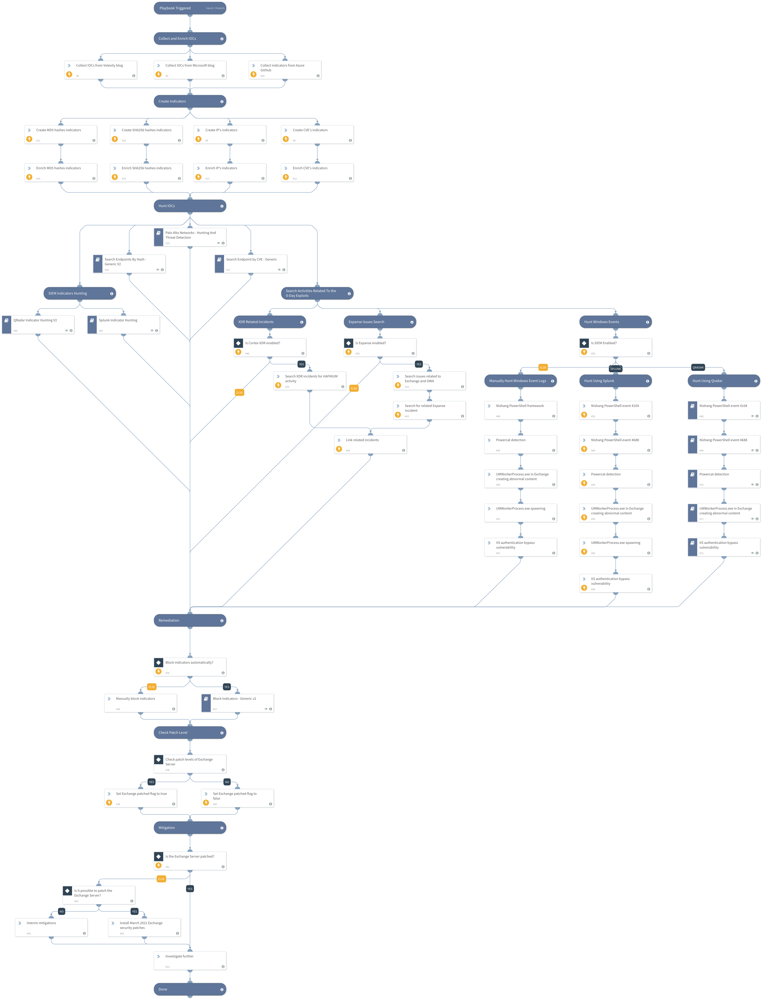

This playbook includes the following tasks:
Collect indicators to be used in your threat hunting process. Retrieve IOCs related to HAFNIUM and the exploited exchange 0-day vulnerabilities. Discover IOCs related to the attack. Query firewall logs to detect malicious network activity. Search endpoint logs for malicious hashes to detect compromised hosts. (Available from Cortex XSOAR 5.5.0). Block indicators Note: This is a beta playbook, which lets you implement and test pre-release software. Since the playbook is beta, it might contain bugs. Updates to the pack during the beta phase might include non-backward compatible features. We appreciate your feedback on the quality and usability of the pack to help us identify issues, fix them, and continually improve. Read more about the attack on our Unit42 blog: https://unit42.paloaltonetworks.com/microsoft-exchange-server-vulnerabilities/ Sources: https://www.splunk.com/en_us/blog/security/detecting-hafnium-exchange-server-zero-day-activity-in-splunk.html https://www.microsoft.com/security/blog/2021/03/02/hafnium-targeting-exchange-servers/

## Dependencies

This playbook uses the following sub-playbooks, integrations, and scripts.

### Sub-playbooks

* Splunk Indicator Hunting
* QRadar Indicator Hunting V2
* Search Endpoints By Hash - Generic V2
* Palo Alto Networks - Hunting And Threat Detection
* QRadarFullSearch
* Search Endpoint by CVE - Generic
* Block Indicators - Generic v3

### Integrations

This playbook does not use any integrations.

### Scripts

* Set
* SearchIncidentsV2
* http

### Commands

* linkIncidents
* setIndicators
* extractIndicators
* splunk-search
* expanse-get-issues

## Playbook Inputs

---

| **Name** | **Description** | **Default Value** | **Required** |
| --- | --- | --- | --- |
| BlockIndicatorsAutomatically | Whether to automatically block indicators involved with HAFNIUM exploits. | False | Optional |

## Playbook Outputs

---
There are no outputs for this playbook.

## Playbook Image

---

