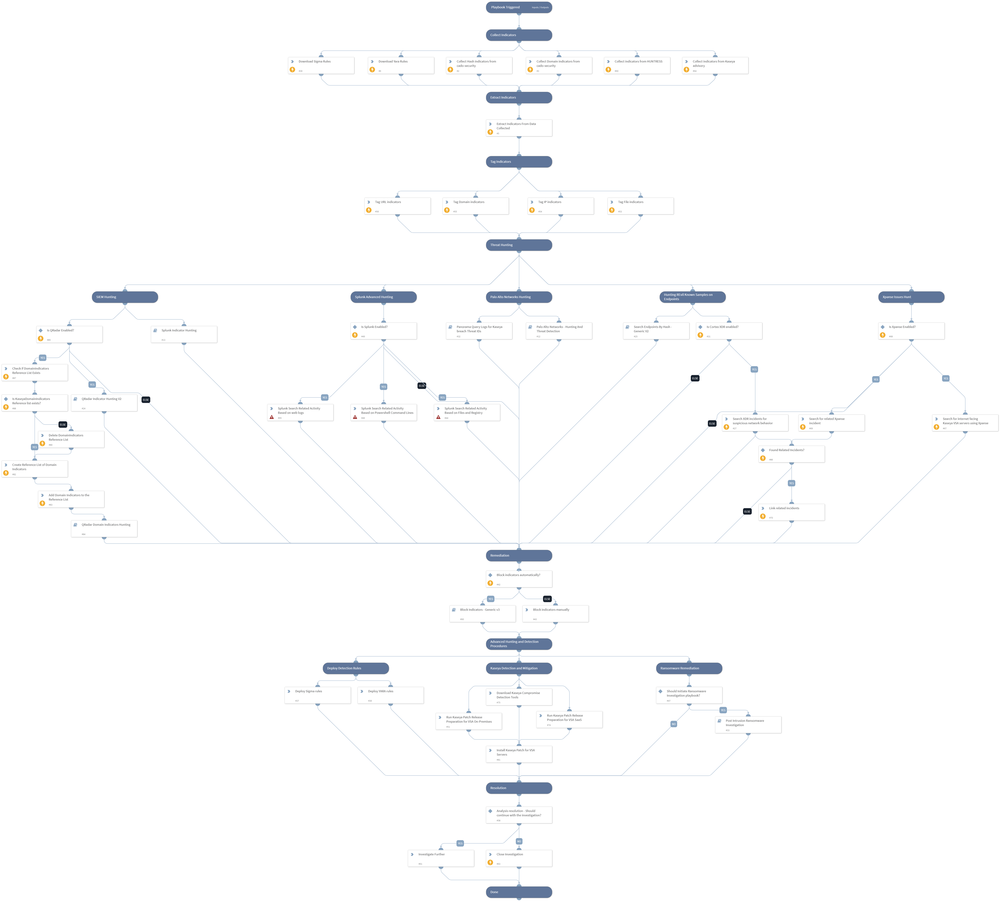

On July 2nd, Kaseya company has experienced an attack against the VSA (Virtual System/Server Administrator) product. Kaseya customers pointed out a ransomware outbreak in their environments.
Further investigation revealed that REvil group exploited VSA zero-day vulnerabilities for authentication bypass and arbitrary command execution. This allowed the attacker to deploy ransomware on Kaseya customers' endpoints.

This playbook should be trigger manually and includes the following tasks: 

* Collect related known indicators from several sources.
* Indicators, PS commands, Registry changes and known HTTP requests hunting using PAN-OS, Cortex XDR and SIEM products.
    * Splunk advanced queries can be modified through the playbook inputs.
    * QRadar query is done using Reference Set and "QRadar Indicator Hunting V2" playbook
* Search for internet facing Kaseya VSA servers using Xpanse.
* Block indicators automatically or manually.
* Provide advanced hunting and detection capabilities.
* Mitigation using Kaseya On-Premises and SaaS patch.

More information:
[Kaseya Incident Overview & Technical Details](https://helpdesk.kaseya.com/hc/en-gb/articles/4403584098961)

Note: This is a beta playbook, which lets you implement and test pre-release software. Since the playbook is beta, it might contain bugs. Updates to the pack during the beta phase might include non-backward compatible features. We appreciate your feedback on the quality and usability of the pack to help us identify issues, fix them, and continually improve.

## Dependencies

This playbook uses the following sub-playbooks, integrations, and scripts.

### Sub-playbooks

* Block Indicators - Generic v3
* Search Endpoints By Hash - Generic V2
* Palo Alto Networks - Hunting And Threat Detection
* Post Intrusion Ransomware Investigation
* Panorama Query Logs for Kaseya breach Threat IDs
* QRadar Domain Indicators Hunting
* QRadar Indicator Hunting V2
* Splunk Indicator Hunting

### Integrations

* SplunkPy

### Scripts

* SearchIncidentsV2
* http
* ParseHTMLIndicators
* isError

### Commands

* expanse-get-issues
* closeInvestigation
* qradar-delete-reference-set
* splunk-search
* linkIncidents
* qradar-create-reference-set-value
* qradar-create-reference-set
* setIndicators
* qradar-get-reference-by-name
* extractIndicators

## Playbook Inputs

---

| **Name** | **Description** | **Default Value** | **Required** |
| --- | --- | --- | --- |
| BlockIndicatorsAutomatically | Whether to automatically block the indicators involved. | False | Optional |
| SplunkEarliestTime | The earliest time for the Splunk search query. | -14d | Optional |
| SplunkLatestTime | The latest time for the Splunk search query. | now | Optional |
| YaraRulesSource | The source of the Yara rules | https://raw.githubusercontent.com/cado-security/DFIR_Resources_REvil_Kaseya/main/IOCs/Yara.rules | Optional |
| SigmaRulesSource | The source of the Sigma rules | https://raw.githubusercontent.com/SigmaHQ/sigma/master/rules/windows/process_creation/win_apt_revil_kaseya.yml | Optional |
| QRadarSearchTimeRange | The time range for the QRadar search query. | LAST 14 DAYS | Optional |
| SplunkAdvancedSearch4FilesandReg | Search splunk for related REvil - Kaseya breach file names. | index=* "c:\\kworking\\agent.exe" OR "c:\\windows\\mpsvc.dll" OR "c:\\windows\\system32\\sfc.dll" OR "c:\\kworking\\binco-readme.txt" OR "c:\\kworking\\agent.crt" OR "c:\\windows\\cert.exe" OR "SOFTWARE\\BlackLivesMatter" | Optional |
| SplunkAdvancedSearch4PSCMD | Search Splunk for related REvil - Kaseya breach Powershell behaviours. | index=* "*C:\\Windows\\cert.exe &amp; echo %RANDOM%*" OR "*C:\\Windows\\cert.exe -decode c:\\kworking\\agent.crt*" OR "*del /q /f c:\\kworking\\agent.crt*" | Optional |
| SplunkAdvancedSearch4WebLog | Search Splunk for related REvil - Kaseya breach web access logs activity. | index=* ("POST" AND "/dl.asp") OR ("GET" AND "/done.asp") OR ("POST" AND "/cgi-bin/KUpload.dll") OR ("POST" AND "/userFilterTableRpt.asp")  | Optional |
| EDLDomainBlocklist | The name of the EDL Domain Block List. | Demisto Remediation - Domain EDL | Optional |
| QRadarDomainFieldName | The QRadar domain field name to check against the Reference Set of Kaseya domains. | domain | Optional |
| ReferenceListName | The reference list name to create in QRadar for the Domain Indicators Hunting. | KaseyaDomainIndicators | Optional |

## Playbook Outputs

---
There are no outputs for this playbook.

## Playbook Image

---

